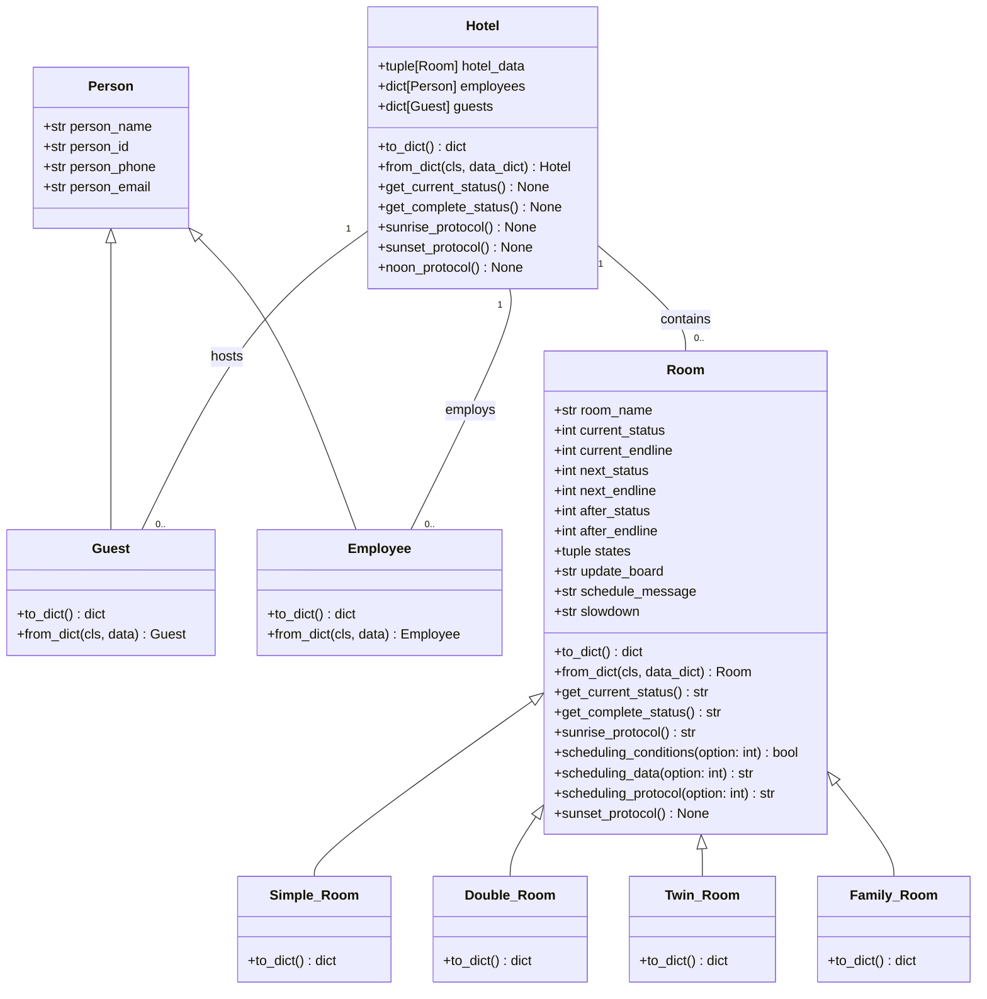

# Object Oriented Programming Project: Kairos Hotel
## Concept
The idea raises by looking for a OOP application, an aplication with an emphasis on information management and that it was motivating for the Python coding.
This hotel idea has a focus on representing the room management concept, being represented with predetermined variables, which are condensated in the Python classes designed for that: `Hotel`, `Room` and `Person`.
## Class Diagram


## The `Person` class
**At the moment Person class related methods are only utilized to make Python Objects into json format**
### Definition
```python
class Person():
    def __init__(self, person_data: list = None):
        if person_data is None:
            person_data = [("NO_LAST_NAME", "NO_FIRST_NAME"), "id_number", "tel_number", "username@server.domain"]
        self.person_name = person_data[0]
        self.person_id = person_data[1]
        self.person_phone = person_data[2]
        self.person_email = person_data[3]

class Guest(Person):
    def __init__(self, person_data: list = None):
        super().__init__(person_data)
        if person_data is None:
            person_data = [("NO_LAST_NAME", "NO_FIRST_NAME"), "id_number", "tel_number", "username@server.domain", "guest_adress", "mm/dd/yyyy"]
        self.guest_adress = person_data[4]
        self.guest_birthday = person_data[5]

class Employee(Person):
    def __init__(self, person_data: list = None):
        super().__init__(person_data)
        if person_data is None:
            person_data = [("NO_LAST_NAME", "NO_FIRST_NAME"), "id_number", "tel_number", "username@server.domain", "job_title", "employee_code"]
        self.employee_role = person_data[4]
        self.employee_id = person_data[5]
```
`Person`'s `__init__`  is represented by `person_data`, a `list`, this is designed like that because by the moment, is easier to ad objects to a undetermined length list than define each one at the `__init__`, so let's see what exactly is a Person, Guest and a Employee in this project:

`Person`
| `Person.person_data` index | `self.` Attribute | Description |
| ------------ | ------------ | ------------ |
| `person_data[0]` | `person_name` | A `tuple` that identifies the person last and first name |
| `person_data[1]` | `person_id` | A `str` that represents the person identification number |
| `person_data[2]` | `person_phone` | A `str` that represents the person cellphone number |
| `person_data[3]` | `person_email` | A `str` that represents the person email address |

`Guest`
| `Guest.person_data` index | `self.` Attribute | Description |
| ------------ | ------------ | ------------ |
| `person_data[4]` | `guest_adress` |  A `str` that represents the guest residence address |
| `person_data[5]` | `guest_birthday` | A `str` that represents the guest birtday date |

`Employee`
| `Employee.person_data` index | `self.` Attribute | Description |
| ------------ | ------------ | ------------ |
| `person_data[4]` | `employee_role` |  A `str` that represents the employee role |
| `person_data[5]` | `employee_id` | A `str` that represents the employee's id code |

### The `Guest` only method
```python
@classmethod
def registration(cls):
    Collects guest information from user input and creates a Guest object.

    It then returns an instance of the Guest class populated with the provided information.
    """
    print("Registration:")
    surname = str(input("Last Name         --> "))
    name =    str(input("First Name        --> "))
    ide =     str(input("Identification    --> "))
    phone =   str(input("Phone Number      --> "))
    email =   str(input("Email Adress      --> "))
    adress =  str(input("Home Adress       --> "))
    birth =   str(input("Birthday          --> "))
    return cls([(surname, name), ide, phone, email, adress, birth])
```
Collects guest information from user input and creates a `Guest` object.


## **The `Room` class**
### Definition
```python
class Room():
    definition: str = "A part or division of a building enclosed by walls, floor, and ceiling"
    def __init__(self, room_data: list = None):

        if room_data is None:
            room_data = ["NOINFO", 0, 0, 0, 0, 0, 0]
        self._room_name = room_data[0]
        self._current_status = room_data[1]
        self._current_endline = room_data[2]
        self._next_status = room_data[3]
        self._next_endline = room_data[4]
        self._after_status = room_data[5]
        self._after_endline = room_data[6]
```
As we can see, `Room`'s `__init__`  is represented by `room_data`, a `list`, this is designed like that because by the moment, is easier to ad objects to a undetermined length list than define each one at the `__init__`, so let's see what exactly is a Room in this project:

| `Room.room_data` index | `self.` Attribute | Description |
| ------------ | ------------ | ------------ |
| `room_data[0]` | `room_name` | A `str` that identifies the room |
| `room_data[1]` | `current_status` | An `int` that represents the current "activity" of the room |
| `room_data[2]` | `current_endline` | An `int` that represent the current "activity" days left to end |
| `room_data[3]` | `next_status` | An `int` that represents the "next activity" of the room |
| `room_data[4]` | `next_endline` | An `int` that represent the "next activity" days left to end |
| `room_data[5]` | `after_status` | An `int` that represents the "after activity" of the room |
| `room_data[6]` | `after_endline` | An `int` that represent the "after activity" days left to end |

You may notice the "An `int` that represents the activity of the room" quote, that refers to one of the atributes those are independent of `room_data`:

```python
self._states = ("NOINFO", "AVAILABLE", "RESERVED", "OCCUPIED", "CLEANING", "MAINTENANCE", "DISABLED")
self._update_board = f" STATUS          TO DO\n
                      {self.states[1]}       press 1\n
                      {self.states[2]}        press 2\n
                      {self.states[3]}        press 3\n
                      {self.states[4]}        press 4\n
                      {self.states[5]}     press 5\n
                      {self.states[6]}        press 6\n"
self._schedule_message = "Write the days to schedule"
self._slowdown = "\n\t...\t...\t...\t..."
```
Let's see:
| `self.` Attribute | Description |
| ------------ | ------------ |
| `states` | All three `_status` attributes refers to the `self.states` index. |
| `update_board` | Used in the methods those modifies `_status` and `_endline` attributes. |
| `schedule_message` |Used in the methods those modifies `_status` and `_endline` attributes. |
| `slowdown` | An artificial delay in the methods execution for testing quality purposes. |

### The `Room` Methods
```python
def to_dict(self) -> dict:
    #...
    #code

@classmethod
def from_dict(cls, data_dict: dict): 
    #...
    #code

def get_current_status(self) -> str:   
    #...
    #code
       
def get_complete_status(self) -> str:
    #...
    #code

def scheduling_conditions(self, option: int) -> bool:
    #...
    #code
    #...
    #more code
    #...
    #even more code
    #...

def def scheduling_data(self, option: int) -> str:
    #...
    #code
    #...
    #more code
    #...
    #even more code
    #...

def scheduling_protocol(self, option: int) -> str:
    #...
    #code
    #...
    #more code
    #...
    #even more code
    #...
```
- `to_dict(self)`
<details><summary>Details</summary>
<p>
  
  ```python
  def to_dict(self) -> dict:
        return {"room_name": self._room_name,
                "current_status": self._current_status,
                "current_endline": self._current_endline,
                "next_status": self._next_status,
                "next_endline": self._next_endline,
                "after_status": self._after_status,
                "after_endline": self._after_endline}
  ```
  Serializes the `Room` object into a dictionary format for the JSON convertion.


</p>
</details>


- `from_dict(cls, data_dict)`
<details><summary>Details</summary>
<p>
  
  ```python
  @classmethod
    def from_dict(cls, data_dict: dict):
        room_data = [data_dict["room_name"],
                     data_dict["current_status"],
                     data_dict["current_endline"],
                     data_dict["next_status"],
                     data_dict["next_endline"],
                     data_dict["after_status"],
                     data_dict["after_endline"]]
        return cls(room_data)
  ```
  Creates a `Room` object from a dictionary in a JSON file.

</p>
</details>

- `get_current_status(self)`
<details><summary>Details</summary>
<p>
  
  ```python
  def get_current_status(self) -> str:
        return f"{self._room_name}:  {self._states[self._current_status]}"
  ```
  Only returns the `current_status` of the room

</p>
</details>


- `get_complete_status(self)`
<details><summary>Details</summary>
<p>
  
  ```python
  def get_complete_status(self) -> str:
        return f"{self._room_name}:    {self._states[self._current_status]}    {self._current_endline} days left  -  {self._states[self._next_status]}    {self._next_endline} days next  -  {self._states[self._after_status]}    {self._after_endline} days after"

  ```
  Returns `current_status`, `next_status`, `after_status` and `_endline`'s of the room
</p>
</details>


- `scheduling_conditions(self, option)`
<details><summary>Details</summary>
<p>
  
  ```python
  def scheduling_conditions(self, option: int) -> bool:
        schedule_type = (f"{self._room_name}: no information was found, please check", 
                         f"{self._room_name}: ({self.definition})  -  RIGHT NOW",
                         f"{self._room_name}: ({self.definition})  -  {self._current_endline} DAYS",
                         f"{self._room_name}: ({self.definition})  -  {self._current_endline + self._next_endline} DAYS",
                         f"{self._room_name}:       {self._states[self._current_status]}        -  RIGHT NOW",
                         f"{self._room_name}:       {self._states[self._current_status]}        -  {self._current_endline} DAYS",
                         f"{self._room_name}: {self._states[self._current_status]} --- {self._states[self._next_status]}  -  {self._current_endline + self._next_endline} DAYS")
        schedule_data = schedule_type[0]

        conditions = {1: [(self._current_status == 1 and self._next_endline == 0, schedule_type[1]),
                          (self._current_status >= 1 and self._next_endline == 0, schedule_type[2]),
                          (self._next_status == 1 and self._after_endline == 0, schedule_type[2])],
                      2: [(self._current_status == 1 and self._next_endline == 0, schedule_type[1]),
                          (self._current_status >= 1 and self._next_endline == 0, schedule_type[2]),
                          (self._next_status == 1 and self._after_endline == 0, schedule_type[2]),
                          (self._next_status >= 1 and self._after_endline == 0, schedule_type[3]),
                          (self._after_status == 1, schedule_type[3])],
                      3: [(self._current_status == 3 and self._next_endline == 0, schedule_type[5]),
                          (self._next_status == 3 and self._after_endline == 0, schedule_type[6]),
                          (self._current_status == 5 and self._next_endline == 0, schedule_type[5]),
                          (self._next_status == 5 and self._after_endline == 0, schedule_type[6]),
                          (self._current_status == 6 and self._next_endline == 0, schedule_type[5]),
                          (self._next_status == 6 and self._after_endline == 0, schedule_type[6])],
                      4: [(self._current_status == 1 and self._next_endline == 0, schedule_type[4]),
                          (self._next_status == 1 and self._after_endline == 0, schedule_type[5]),
                          (self._after_status == 1, schedule_type[6]),
                          (self._current_status == 3 and self._next_endline == 0, schedule_type[5]),
                          (self._next_status == 3 and self._after_endline == 0, schedule_type[6]),
                          (self._current_status == 6 and self._next_endline == 0, schedule_type[5]),
                          (self._next_status == 6 and self._after_endline == 0, schedule_type[6])],
                      5: [(self._current_status == 1 and self._next_endline == 0, schedule_type[4]),
                          (self._next_status == 1 and self._after_endline == 0, schedule_type[5]),
                          (self._after_status == 1, schedule_type[6]),
                          (self._current_status < 6 and self._next_endline == 0, schedule_type[5]),
                          (self._next_status < 6 and self._after_endline == 0, schedule_type[6])]}

        for condition, result in conditions.get(option, []):
            if condition:
                schedule_data = result
                break
            
        return schedule_data
  ```
  | Objects | Description |
  | ------------ | ------------ |
  | `conditions` | A `dict`, each element is a conditional identified by a codified name  |
  | `conditional_status` | A `list`'s `list` with the `conditions[key]` those aplies to `states`' elements, excepting `AVAILABLE`  |
  | `room_conditions` | Uses the `option` `int(input())` to identify the scheduling command |

  The `any()` function and by extension, this method returns True if any conditional in `room_conditions` are true, otherwise it returns False.
  ```python
  return any(conditions[c] for c in room_conditions)
  ```

</p>
</details>


- `scheduling_data(self, option)`
<details><summary>Details</summary>
<p>
  
  ```python
  def scheduling_data(self, option: int) -> str:
        schedule_type = (f"{self.room_name}: no information was found, please check", 
                         f"{self.room_name}: ({self.definition})  -->  RIGHT NOW",
                         f"{self.room_name}: ({self.definition})  -->  {self.current_endline} DAYS",
                         f"{self.room_name}: ({self.definition})  -->  {self.current_endline + self.next_endline} DAYS",
                         f"{self.room_name}:       {self.states[self.current_status]}        -->  RIGHT NOW",
                         f"{self.room_name}:       {self.states[self.current_status]}        -->  {self.current_endline} DAYS",
                         f"{self.room_name}: {self.states[self.current_status]} --- {self.states[self.next_status]}  -->  {self.current_endline + self.next_endline} DAYS")

        schedule_data = schedule_type[0]

        conditions = {1: [(self.current_status == 1 and self.next_endline == 0, schedule_type[1]),
                          (self.current_status >= 1 and self.next_endline == 0, schedule_type[2]),
                          (self.next_status == 1 and self.after_endline == 0, schedule_type[2])],
                      2: [(self.current_status == 1 and self.next_endline == 0, schedule_type[1]),
                          (self.current_status >= 1 and self.next_endline == 0, schedule_type[2]),
                          (self.next_status == 1 and self.after_endline == 0, schedule_type[2]),
                          (self.next_status >= 1 and self.after_endline == 0, schedule_type[3]),
                          (self.after_status == 1, schedule_type[3])],
                      3: [(self.current_status == 3 and self.next_endline == 0, schedule_type[5]),
                          (self.next_status == 3 and self.after_endline == 0, schedule_type[6]),
                          (self.current_status == 5 and self.next_endline == 0, schedule_type[5]),
                          (self.next_status == 5 and self.after_endline == 0, schedule_type[6]),
                          (self.current_status == 6 and self.next_endline == 0, schedule_type[5]),
                          (self.next_status == 6 and self.after_endline == 0, schedule_type[6])],
                      4: [(self.current_status == 1 and self.next_endline == 0, schedule_type[4]),
                          (self.next_status == 1 and self.after_endline == 0, schedule_type[5]),
                          (self.after_status == 1, schedule_type[6]),
                          (self.current_status == 3 and self.next_endline == 0, schedule_type[5]),
                          (self.next_status == 3 and self.after_endline == 0, schedule_type[6]),
                          (self.current_status == 6 and self.next_endline == 0, schedule_type[5]),
                          (self.next_status == 6 and self.after_endline == 0, schedule_type[6])],
                      5: [(self.current_status == 1 and self.next_endline == 0, schedule_type[4]),
                          (self.next_status == 1 and self.after_endline == 0, schedule_type[5]),
                          (self.after_status == 1, schedule_type[6]),
                          (self.current_status < 6 and self.next_endline == 0, schedule_type[5]),
                          (self.next_status < 6 and self.after_endline == 0, schedule_type[6])]}

        for condition, result in conditions.get(option, []):
            if condition:
                schedule_data = result
                break
            
        return schedule_data
  ```
  | Objects | Description |
  | ------------ | ------------ |
  | `schedule_type` | A `tuple` with the posible returns |
  | `schedule_data` | Is the method's `str` return, modified by the conditionals |
  | `conditions` | A `dict`, each element relates the `option` `int(input())` values with a `list` of `tuple`: a conditional, and a `schedule_type` item |

  The `for condition, result in conditions.get(option, []):` statement checks the `list` of `tuple` asignated by `option`, returns the `schedule_type` item if the condition is `True`.
  ```python
  for condition, result in conditions.get(option, []):
      if condition:
          schedule_data = result
          break
            
  return schedule_data
  ```

</p>
</details>


- `scheduling_protocol(self, option)`
<details><summary>Details</summary>
<p>
  
  ```python
  def scheduling_protocol(self, option: int) -> str:
        status_update = f"\n{self._room_name}: An error has raised, please try again.{self._slowdown}"

        if option == 1:         
            schedule_update_1 = int(input(f"{self._states[2]}:  {self._schedule_message}\n  --> "))
            schedule_update_2 = int(input(f"{self._states[3]}:  {self._schedule_message}\n  --> "))

            if self._current_status == 1 and self._next_endline == 0:
                self._current_status, self._current_endline = 2, schedule_update_1
                self._next_status, self._next_endline = 3, schedule_update_2
                
            elif self._current_status >= 1 and self._next_endline == 0:
                self._next_status, self._next_endline = 2, schedule_update_1
                self._after_status, self._after_endline = 3, schedule_update_2

            elif self._next_status == 1 and self._after_endline == 0:
                self._next_status, self._next_endline = 2, schedule_update_1
                self._after_status, self._after_endline = 3, schedule_update_2

            status_update = f"{self._room_name} has been {self._states[2]}.{self._slowdown}"
            

        elif option == 2:
            schedule_update_1 = int(input(f"\n{self._states[3]}:  {self._schedule_message}\n  --> "))

            if self._current_status == 1 and self._next_endline == 0:
                self._current_status, self._current_endline = 3, schedule_update_1

            elif self._current_status >= 1 and self._next_endline == 0:
                self._next_status, self._next_endline = 3, schedule_update_1

            elif self._next_status == 1 and self._after_endline == 0:
                self._next_status, self._next_endline = 3, schedule_update_1

            elif self._next_status >= 1 and self._after_endline == 0:
                self._after_status, self._after_endline = 3, schedule_update_1

            elif self._after_status == 1:
                self._after_status, self._after_endline = 3, schedule_update_1

            status_update = f"{self._room_name} has been {self._states[3]}.{self._slowdown}"


        elif option == 3:
            schedule_update_1 = int(input(f"\n{self._states[4]}:  {self._schedule_message}\n  --> "))

            if self._current_status == 3 and self._next_endline == 0:
                self._next_status, self._next_endline = 4, schedule_update_1

            elif self._next_status == 3 and self._after_endline == 0:
                self._after_status, self._after_endline = 4, schedule_update_1

            elif self._current_status == 5 and self._next_endline == 0:
                self._next_status, self._next_endline = 4, schedule_update_1

            elif self._next_status == 5 and self._after_endline == 0:
                self._after_status, self._after_endline = 4, schedule_update_1

            elif self._current_status == 6 and self._next_endline == 0:
                self._next_status, self._next_endline = 4, schedule_update_1

            elif self._next_status == 6 and self._after_endline == 0:
                self._after_status, self._after_endline = 4, schedule_update_1

            status_update = f"{self._room_name} has scheduled a {self._states[4]}.{self._slowdown}"


        elif option == 4:
            schedule_update_1 = int(input(f"\n{self._states[5]}:  {self._schedule_message}\n  --> "))

            if self._current_status == 1 and self._next_endline == 0:
                self._current_status, self._current_endline = 5, schedule_update_1

            elif self._next_status == 1 and self._after_endline == 0:
                self._next_status, self._next_endline = 5, schedule_update_1

            elif self._after_status == 1:
                self._after_status, self._after_endline = 5, schedule_update_1

            elif self._current_status == 3 and self._next_endline == 0:
                self._next_status, self._next_endline = 5, schedule_update_1

            elif self._next_status == 3 and self._after_endline == 0:
                self._after_status, self._after_endline = 5, schedule_update_1

            elif self._current_status == 6 and self._next_endline == 0:
                self._next_status, self._next_endline = 5, schedule_update_1

            elif self._next_status == 6 and self._after_endline == 0:
                self._after_status, self._after_endline = 5, schedule_update_1

            status_update = f"{self._room_name} has scheduled a {self._states[5]}.{self._slowdown}"


        elif option == 5:
            schedule_update_1 = int(input(f"\n{self._states[6]}:  {self._schedule_message}\n  --> "))

            if self._current_status == 1 and self._next_endline == 0:
                self._current_status, self._current_endline = 6, schedule_update_1

            elif self._next_status == 1 and self._after_endline == 0:
                self._next_status, self._next_endline = 6, schedule_update_1

            elif self._after_status == 1:
                self._after_status, self._after_endline = 6, schedule_update_1

            elif self._current_status < 6 and self._next_endline == 0:
                self._next_status, self._next_endline = 6, schedule_update_1

            elif self._next_status < 6 and self._after_endline == 0:
                self._after_status, self._after_endline = 6, schedule_update_1

            status_update = f"{self._room_name} has been {self._states[6]}.{self._slowdown}"


        return status_update
  ```
  | Objects | Description |
  | ------------ | ------------ |
  | `status_update` | Is the method's `str` return, modified by the conditionals |
  | `schedule_update_1` | An `int(input())`, the new `_endline` attribute value. |
  | `schedule_update_2` | An `int(input())`, the new `_endline` attribute value. |
  This method returns the updating of a room `_state` as a message, based in the same conditionals used above.
     
  This method has the structure that `scheduling_conditions()` and `scheduling_data()` used to have.

</p>
</details>


### `Room`'s subclasses
```python
class Simple_Room(Room):
    definition: str = "Simple Bed, One Bathroom"
    def __init__(self, room_data: list = None):
        super().__init__(room_data)

class Double_Room(Room):
    definition: str = "Large Bed, One Bathroom"
    def __init__(self, room_data: list = None):
        super().__init__(room_data)

class Twin_Room(Room):
    definition: str = "Two Beds, Two Bathrooms"
    def __init__(self, room_data: list = None):
        super().__init__(room_data)

class Family_Room(Room):
    definition: str = "Three Beds, Two Bathrooms"
    def __init__(self, room_data: list = None):
        super().__init__(room_data)
```
For now are merely placeholders.


## **The `Hotel` class**
### Definition
```python
class Hotel():
    def __init__(self, hotel_data: tuple[Room, ...] = (), employees: dict = None, guests: dict = None):
        self._hotel_data = hotel_data
        self._employees = employees
        self._guests = guests
    
```
So, the Hotel's employees and guests data are two separated `dict` objects.

### `Hotel` structure
The `Room` objects are organized in a `tuple`.
```python
#example

KAIROS = Hotel((R101, R102, R103, R104, R201, R202, R203, R204, R301, R302, R303, R304), employees, guests)

R101 = Simple_Room(["Room 101", 3, 1, 1, 1, 0, 0])
R102 = Simple_Room(["Room 102", 2, 2, 3, 3, 0, 0])
R103 = Double_Room(["Room 103", 4, 1, 5, 2, 0, 0])
R104 = Double_Room(["Room 104", 3, 3, 2, 1, 3, 4])

R201 = Simple_Room(["Room 201", 3, 0, 4, 1, 0, 0])
R202 = Simple_Room(["Room 202", 5, 2, 0, 0, 0, 0])
R203 = Twin_Room(["Room 203", 5, 0, 6, 2, 3, 3])
R204 = Twin_Room(["Room 204", 0, 0, 0, 0, 0, 0])

R301 = Double_Room(["Room 301", 2, 3, 3, 3, 5, 2])
R302 = Double_Room(["Room 302", 6, 2, 4, 2, 1, 1])
R303 = Family_Room(["Room 303", 4, 2, 1, 1, 0, 0])
R304 = Family_Room(["Room 304", 1, 1, 0, 0, 0, 0])
```

The `employees` `dict` relates the employee's `employee_role` attribute with the actual `Employee` object.
```python
#example

employees = {"NOINFO": Employee([("NOLASTNAME", "NOFIRSTNAME"), "0000000000", "000-0000", "username@server.domain", "NOINFO", "E000"]),
             "Receptionist": Employee([("Garcia", "Laura"), "0012345678", "555-0101", "laura.garcia@hotel.com", "Receptionist", "E001"]),
             "Housekeeper": Employee([("Smith", "John"), "0023456789", "555-0202", "john.smith@hotel.com", "Housekeeper", "E002"]),
             "Concierge": Employee([("Doe", "Jane"), "0034567890", "555-0303", "jane.doe@hotel.com", "Concierge", "E003"]),
             "Chef": Employee([("Williams", "Emily"), "0056789012", "555-0505", "emily.williams@hotel.com", "Chef", "E004"]),
             "Maintenance Worker": Employee([("Martinez", "Carlos"), "0067890123", "555-0606", "carlos.martinez@hotel.com", "Maintenance Worker", "E005"]),
             "General Manager": Employee([("Davis", "Kevin"), "0089012345", "555-0808", "kevin.davis@hotel.com", "General Manager", "E006"]),
             "Front Desk Manager": Employee([("Rodriguez", "Angela"), "0090123456", "555-0909", "angela.rodriguez@hotel.com", "Front Desk Manager", "E007"]),
             "Security Officer": Employee([("Lee", "Daniel"), "0101234567", "555-1010", "daniel.lee@hotel.com", "Security Officer", "E008"])}
```

The `guests` `dict` relates the room's `room_name` attribute with three `Person` objects, that represents the by now unexistent attributes `current_person`, `next_person` y `after_person`, related but independent to the `Room` attributes.
```python
#example

guests = {"Room 101": (Guest([("Smith", "John"), "987654321", "555-9876", "john.smith@example.com", "123 Elm St", "03/25/1985"]),
                       employees["Housekeeper"],
                       employees["NOINFO"]),
          "Room 102": (Guest([("Doe", "Jane"), "123456789", "555-1234", "jane.doe@example.com", "456 Oak St", "07/14/1990"]), 
                       Guest([("Doe", "Jane"), "123456789", "555-1234", "jane.doe@example.com", "456 Oak St", "07/14/1990"]),
                       employees["NOINFO"]),
          "Room 103": (employees["Concierge"],
                       employees["Maintenance Worker"],
                       employees["NOINFO"]),
          "Room 104": (Guest([("Johnson", "Michael"), "234567891", "555-2345", "michael.johnson@example.com", "789 Pine St", "11/02/1975"]),
                       Guest([("Brown", "Emily"), "345678912", "555-3456", "emily.brown@example.com", "101 Maple St", "05/16/1982"]),
                       Guest([("Brown", "Emily"), "345678912", "555-3456", "emily.brown@example.com", "101 Maple St", "05/16/1982"])),
          "Room 201": (Guest([("Williams", "David"), "456789123", "555-4567", "david.williams@example.com", "202 Cedar St", "09/10/1988"]),
                       employees["Concierge"],
                       employees["NOINFO"]),
          "Room 202": (employees["Maintenance Worker"],
                       employees["NOINFO"],
                       employees["NOINFO"]),
          "Room 203": (employees["Maintenance Worker"],
                     employees["Front Desk Manager"],
                     Guest([("Jones", "Sarah"), "567891234", "555-5678", "sarah.jones@example.com", "303 Birch St", "12/30/1992"])),
          "Room 204": (employees["NOINFO"],
                       employees["NOINFO"],
                       employees["NOINFO"]),
          "Room 301": (Guest([("Garcia", "Carlos"), "678912345", "555-6789", "carlos.garcia@example.com", "404 Spruce St", "08/20/1983"]),
                       Guest([("Garcia", "Carlos"), "678912345", "555-6789", "carlos.garcia@example.com", "404 Spruce St", "08/20/1983"]),
                       employees["Maintenance Worker"]),
          "Room 302": (employees["Front Desk Manager"],
                       employees["Concierge"],
                       employees["Housekeeper"]),
          "Room 303": (employees["Concierge"],
                       employees["Housekeeper"],
                       employees["NOINFO"]),
          "Room 304": (employees["Housekeeper"],
                       employees["NOINFO"],
                       employees["NOINFO"])}
```

<details><summary>JSON Representation</summary>
<p>  
    
  ```json
  {
    "hotel_data": [
        {
            "room_name": "Room 101",
            "current_status": 3,
            "current_endline": 1,
            "next_status": 1,
            "next_endline": 1,
            "after_status": 0,
            "after_endline": 0,
            "type": "Simple_Room"
        },
        {
            "room_name": "Room 102",
            "current_status": 2,
            "current_endline": 2,
            "next_status": 3,
            "next_endline": 3,
            "after_status": 0,
            "after_endline": 0,
            "type": "Simple_Room"
        },
        {
            "room_name": "Room 103",
            "current_status": 4,
            "current_endline": 1,
            "next_status": 5,
            "next_endline": 2,
            "after_status": 0,
            "after_endline": 0,
            "type": "Double_Room"
        },
        {
            "room_name": "Room 104",
            "current_status": 3,
            "current_endline": 3,
            "next_status": 2,
            "next_endline": 1,
            "after_status": 3,
            "after_endline": 4,
            "type": "Double_Room"
        },
        {
            "room_name": "Room 201",
            "current_status": 3,
            "current_endline": 0,
            "next_status": 4,
            "next_endline": 1,
            "after_status": 0,
            "after_endline": 0,
            "type": "Simple_Room"
        },
        {
            "room_name": "Room 202",
            "current_status": 5,
            "current_endline": 2,
            "next_status": 0,
            "next_endline": 0,
            "after_status": 0,
            "after_endline": 0,
            "type": "Simple_Room"
        },
        {
            "room_name": "Room 203",
            "current_status": 5,
            "current_endline": 0,
            "next_status": 6,
            "next_endline": 2,
            "after_status": 3,
            "after_endline": 3,
            "type": "Twin_Room"
        },
        {
            "room_name": "Room 204",
            "current_status": 0,
            "current_endline": 0,
            "next_status": 0,
            "next_endline": 0,
            "after_status": 0,
            "after_endline": 0,
            "type": "Twin_Room"
        },
        {
            "room_name": "Room 301",
            "current_status": 2,
            "current_endline": 3,
            "next_status": 3,
            "next_endline": 3,
            "after_status": 5,
            "after_endline": 2,
            "type": "Double_Room"
        },
        {
            "room_name": "Room 302",
            "current_status": 6,
            "current_endline": 2,
            "next_status": 4,
            "next_endline": 2,
            "after_status": 1,
            "after_endline": 1,
            "type": "Double_Room"
        },
        {
            "room_name": "Room 303",
            "current_status": 4,
            "current_endline": 2,
            "next_status": 1,
            "next_endline": 1,
            "after_status": 0,
            "after_endline": 0,
            "type": "Family_Room"
        },
        {
            "room_name": "Room 304",
            "current_status": 1,
            "current_endline": 1,
            "next_status": 0,
            "next_endline": 0,
            "after_status": 0,
            "after_endline": 0,
            "type": "Family_Room"
        }
    ],
    "employees": {
        "NOINFO": {
            "person_name": [
                "NOLASTNAME",
                "NOFIRSTNAME"
            ],
            "person_id": "0000000000",
            "person_phone": "000-0000",
            "person_email": "username@server.domain",
            "employee_role": "NOINFO",
            "employee_id": "E000"
        },
        "Receptionist": {
            "person_name": [
                "Garcia",
                "Laura"
            ],
            "person_id": "0012345678",
            "person_phone": "555-0101",
            "person_email": "laura.garcia@hotel.com",
            "employee_role": "Receptionist",
            "employee_id": "E001"
        },
        "Housekeeper": {
            "person_name": [
                "Smith",
                "John"
            ],
            "person_id": "0023456789",
            "person_phone": "555-0202",
            "person_email": "john.smith@hotel.com",
            "employee_role": "Housekeeper",
            "employee_id": "E002"
        },
        "Concierge": {
            "person_name": [
                "Doe",
                "Jane"
            ],
            "person_id": "0034567890",
            "person_phone": "555-0303",
            "person_email": "jane.doe@hotel.com",
            "employee_role": "Concierge",
            "employee_id": "E003"
        },
        "Chef": {
            "person_name": [
                "Williams",
                "Emily"
            ],
            "person_id": "0056789012",
            "person_phone": "555-0505",
            "person_email": "emily.williams@hotel.com",
            "employee_role": "Chef",
            "employee_id": "E004"
        },
        "Maintenance Worker": {
            "person_name": [
                "Martinez",
                "Carlos"
            ],
            "person_id": "0067890123",
            "person_phone": "555-0606",
            "person_email": "carlos.martinez@hotel.com",
            "employee_role": "Maintenance Worker",
            "employee_id": "E005"
        },
        "General Manager": {
            "person_name": [
                "Davis",
                "Kevin"
            ],
            "person_id": "0089012345",
            "person_phone": "555-0808",
            "person_email": "kevin.davis@hotel.com",
            "employee_role": "General Manager",
            "employee_id": "E006"
        },
        "Front Desk Manager": {
            "person_name": [
                "Rodriguez",
                "Angela"
            ],
            "person_id": "0090123456",
            "person_phone": "555-0909",
            "person_email": "angela.rodriguez@hotel.com",
            "employee_role": "Front Desk Manager",
            "employee_id": "E007"
        },
        "Security Officer": {
            "person_name": [
                "Lee",
                "Daniel"
            ],
            "person_id": "0101234567",
            "person_phone": "555-1010",
            "person_email": "daniel.lee@hotel.com",
            "employee_role": "Security Officer",
            "employee_id": "E008"
        }
    },
    "guests": {
        "Room 101": [
            {
                "person_name": {
                    "last": "Smith",
                    "first": "John"
                },
                "person_id": "987654321",
                "person_phone": "555-9876",
                "person_email": "john.smith@example.com",
                "guest_adress": "123 Elm St",
                "guest_birthday": "03/25/1985"
            },
            {
                "employee_role": "Housekeeper"
            },
            {
                "employee_role": "NOINFO"
            }
        ],
        "Room 102": [
            {
                "person_name": {
                    "last": "Doe",
                    "first": "Jane"
                },
                "person_id": "123456789",
                "person_phone": "555-1234",
                "person_email": "jane.doe@example.com",
                "guest_adress": "456 Oak St",
                "guest_birthday": "07/14/1990"
            },
            {
                "person_name": {
                    "last": "Doe",
                    "first": "Jane"
                },
                "person_id": "123456789",
                "person_phone": "555-1234",
                "person_email": "jane.doe@example.com",
                "guest_adress": "456 Oak St",
                "guest_birthday": "07/14/1990"
            },
            {
                "employee_role": "NOINFO"
            }
        ],
        "Room 103": [
            {
                "employee_role": "Concierge"
            },
            {
                "employee_role": "Maintenance Worker"
            },
            {
                "employee_role": "NOINFO"
            }
        ],
        "Room 104": [
            {
                "person_name": {
                    "last": "Johnson",
                    "first": "Michael"
                },
                "person_id": "234567891",
                "person_phone": "555-2345",
                "person_email": "michael.johnson@example.com",
                "guest_adress": "789 Pine St",
                "guest_birthday": "11/02/1975"
            },
            {
                "person_name": {
                    "last": "Brown",
                    "first": "Emily"
                },
                "person_id": "345678912",
                "person_phone": "555-3456",
                "person_email": "emily.brown@example.com",
                "guest_adress": "101 Maple St",
                "guest_birthday": "05/16/1982"
            },
            {
                "person_name": {
                    "last": "Brown",
                    "first": "Emily"
                },
                "person_id": "345678912",
                "person_phone": "555-3456",
                "person_email": "emily.brown@example.com",
                "guest_adress": "101 Maple St",
                "guest_birthday": "05/16/1982"
            }
        ],
        "Room 201": [
            {
                "person_name": {
                    "last": "Williams",
                    "first": "David"
                },
                "person_id": "456789123",
                "person_phone": "555-4567",
                "person_email": "david.williams@example.com",
                "guest_adress": "202 Cedar St",
                "guest_birthday": "09/10/1988"
            },
            {
                "employee_role": "Concierge"
            },
            {
                "employee_role": "NOINFO"
            }
        ],
        "Room 202": [
            {
                "employee_role": "Maintenance Worker"
            },
            {
                "employee_role": "NOINFO"
            },
            {
                "employee_role": "NOINFO"
            }
        ],
        "Room 203": [
            {
                "employee_role": "Maintenance Worker"
            },
            {
                "employee_role": "Front Desk Manager"
            },
            {
                "person_name": {
                    "last": "Jones",
                    "first": "Sarah"
                },
                "person_id": "567891234",
                "person_phone": "555-5678",
                "person_email": "sarah.jones@example.com",
                "guest_adress": "303 Birch St",
                "guest_birthday": "12/30/1992"
            }
        ],
        "Room 204": [
            {
                "employee_role": "NOINFO"
            },
            {
                "employee_role": "NOINFO"
            },
            {
                "employee_role": "NOINFO"
            }
        ],
        "Room 301": [
            {
                "person_name": {
                    "last": "Garcia",
                    "first": "Carlos"
                },
                "person_id": "678912345",
                "person_phone": "555-6789",
                "person_email": "carlos.garcia@example.com",
                "guest_adress": "404 Spruce St",
                "guest_birthday": "08/20/1983"
            },
            {
                "person_name": {
                    "last": "Garcia",
                    "first": "Carlos"
                },
                "person_id": "678912345",
                "person_phone": "555-6789",
                "person_email": "carlos.garcia@example.com",
                "guest_adress": "404 Spruce St",
                "guest_birthday": "08/20/1983"
            },
            {
                "employee_role": "Maintenance Worker"
            }
        ],
        "Room 302": [
            {
                "employee_role": "Front Desk Manager"
            },
            {
                "employee_role": "Concierge"
            },
            {
                "employee_role": "Housekeeper"
            }
        ],
        "Room 303": [
            {
                "employee_role": "Concierge"
            },
            {
                "employee_role": "Housekeeper"
            },
            {
                "employee_role": "NOINFO"
            }
        ],
        "Room 304": [
            {
                "employee_role": "Housekeeper"
            },
            {
                "employee_role": "NOINFO"
            },
            {
                "employee_role": "NOINFO"
            }
        ]
    }
}
  ```

</p>
</details>


### The `Hotel` Methods
```python
def to_dict(self) -> dict:
    #...
    #code

@classmethod
def from_dict(cls, data_dict: dict): 
    #...
    #code

def get_current_status(self) -> None:
    #...
    #code
    #... 

def get_complete_status(self) -> None:
    #...
    #code
    #... 

def sunrise_protocol(self) -> None:
    #...
    #code
    #... 

def sunset_protocol(self) -> None:
    #...
    #code
    #... 

def noon_protocol(self) -> None:
    #...
    #code
    #...
    #more code
    #...
    #even more code
    #...

def sunset_protocol(self) -> None:
    #...
    #code
        
def midnight_protocol(self) -> None:
    #...
    #code
    #...
    #more code
    #...
    #even more code
    #...

def get_daily_report(self, date: datetime) -> str:
    #...
    #code
    #...
    #more code
    #...
    #even more code
    #...
```
You may notice the method's are apparently identical to the `Room` class methods, let's take a look to the complete code below:

- `to_dict(self)`
<details><summary>Details</summary>
<p>
  
  ```python
  def to_dict(self) -> dict:
        return {"hotel_data": [room.to_dict() for room in self._hotel_data], 
                "employees": {role: emp.to_dict() for role, emp in self._employees.items()},
                "guests": {room_name: [guest.to_dict() if isinstance(guest, Guest) else {"employee_role": guest._employee_role} for guest in guests_list]
                           for room_name, guests_list in self._guests.items()}}
  ```
  Serializes the `Hotel` object into a dictionary format for the JSON convertion.

</p>
</details>


- `from_dict(cls, data_dict)`
<details><summary>Details</summary>
<p>
  
  ```python
  @classmethod
    def from_dict(cls, data_dict: dict):
        room_objects = []
        for room_data in data_dict["hotel_data"]:
            room_type = room_data.pop("type")
            if room_type == "Simple_Room":
                room_objects.append(Simple_Room.from_dict(room_data))
            elif room_type == "Double_Room":
                room_objects.append(Double_Room.from_dict(room_data))
            elif room_type == "Twin_Room":
                room_objects.append(Twin_Room.from_dict(room_data))
            elif room_type == "Family_Room":
                room_objects.append(Family_Room.from_dict(room_data))
            else:
                raise ValueError(f"Unknown room type: {room_type}")
            
        employees = {role: Employee.from_dict(emp_data) for role, emp_data in data_dict.get("employees", {}).items()}
        
        guests = {}
        for room_name, guests_list in data_dict.get("guests", {}).items():
            guests[room_name] = []
            for guest_data in guests_list:
                if "employee_role" in guest_data:
                    employee = next(emp for emp in employees.values() if emp._employee_role == guest_data["employee_role"])
                    guests[room_name].append(employee)
                else:
                    guests[room_name].append(Guest.from_dict(guest_data))

        return cls(tuple(room_objects), employees, guests)   
  ```
  Creates a `Hotel` object from a dictionary in a JSON file.

</p>
</details>


- `get_current_status(self)`
<details><summary>Details</summary>
<p>
  
  ```python
  def get_current_status(self) -> None:
      while True:
            clear_console()
            print("  ROOM       STATUS      MORE INFO")
            for room in self._hotel_data:
                print(f"{room.get_current_status()}  -->  press {(self._hotel_data.index(room)) + 1}")
                time.sleep(1)

            try:
                check = int(input("Continue                  press 0" "\n"
                                  "                         ""  -->  "))
                  
                if check > 0 and check <= len(self._hotel_data):
                    requested = self._hotel_data[check - 1]
                    returned = self._guests[requested._room_name]

                    stat_1_report = f"CURRENT STATUS  -  {requested._states[requested._current_status]}"
                    if requested._current_status > 0: 
                        if isinstance(returned[0], Guest):
                            stat_1_report += f"  -  {returned[0]._person_name[1]} {returned[0]._person_name[0]}  -  {returned[0]._person_phone}"
                        elif isinstance(returned[0], Employee):
                            stat_1_report += f"  -  {returned[0]._employee_role}  -  {returned[0]._person_name[1]} {returned[0]._person_name[0]}"    
                    else: pass

                    time.sleep(1)
                    clear_console()   
                    print(f"   {requested._room_name}\n{stat_1_report}\n")
                    time.sleep(3)
                    break

                elif check == 0: break
                else: raise IntInputError(f"Press a number between 0 and {len(self._hotel_data)}")

            except IntInputError as error: 
                print(f"\n{error}, Returning.\n\n")
                time.sleep(2)
            except ValueError: 
                print("\nPress numbers only, Returning.\n\n")
                time.sleep(2)   
  ```
  It delivers the `room.get_current_status()` for each room of the `Hotel`, with an option to see who is using or in charge of one of them.
  `clear_console()` "resets" the user interface.
  `time.sleep(2)` is an artificial delay in the method execution for testing quality purposes.

</p>
</details>


- `get_complete_status(self)`
<details><summary>Details</summary>
<p>
  
  ```python
  def get_complete_status(self) -> None:
      while True:
            clear_console()
            print("  ROOM            CURRENT STATUS                NEXT STATUS                 AFTER STATUS         MORE INFO")
            for room in self._hotel_data:
                print(f"{room.get_complete_status()}  -->  press {(self._hotel_data.index(room)) + 1}")
                time.sleep(1)

            try:
                check = int(input("Continue                                                                                          press 0""\n"
                                  "                                                                                                   -->  "))     
                
                if check > 0 and check <= len(self._hotel_data):
                    requested = self._hotel_data[check - 1]
                    returned = self._guests[requested._room_name]

                    stat_1_report = f"CURRENT STATUS  -  {requested._states[requested._current_status]}"
                    if requested._current_status > 0: 
                        if isinstance(returned[0], Guest):
                            stat_1_report += f"  -  {returned[0]._person_name[1]} {returned[0]._person_name[0]}  -  {returned[0]._person_phone}"
                        elif isinstance(returned[0], Employee):
                            stat_1_report += f"  -  {returned[0]._employee_role}  -  {returned[0]._person_name[1]} {returned[0]._person_name[0]}"    
                    else: pass

                    stat_2_report = f"NEXT STATUS     -  {requested._states[requested._next_status]}"
                    if requested._next_status > 0: 
                        if isinstance(returned[1], Guest):
                            stat_2_report += f"  -  {returned[1]._person_name[1]} {returned[1]._person_name[0]}  -  {returned[1]._person_phone}"
                        elif isinstance(returned[1], Employee):
                            stat_2_report += f"  -  {returned[1]._employee_role}  -  {returned[1]._person_name[1]} {returned[1]._person_name[0]}"
                    else: pass

                    stat_3_report = f"AFTER STATUS    -  {requested._states[requested._after_status]}"
                    if requested._after_status > 0: 
                        if isinstance(returned[2], Guest):
                            stat_3_report += f"  -  {returned[2]._person_name[1]} {returned[2]._person_name[0]}  -  {returned[2]._person_phone}"
                        elif isinstance(returned[2], Employee):
                            stat_3_report += f"  -  {returned[2]._employee_role}  -  {returned[2]._person_name[1]} {returned[2]._person_name[0]}"
                    else: pass

                    time.sleep(1.5)
                    clear_console()   
                    print(f"   {requested._room_name}\n{stat_1_report}\n{stat_2_report}\n{stat_3_report}\n")
                    time.sleep(4.5)
                    break

                elif check == 0: break
                else: raise IntInputError(f"Press a number between 0 and {len(self._hotel_data)}")

            except IntInputError as error: 
                print(f"\n{error}, Returning.\n\n")
                time.sleep(2)
            except ValueError: 
                print("\nPress numbers only, Returning.\n\n")
                time.sleep(2)
  ```
  Almost the same concept as above, it delivers the `room.get_complete_status()` for each room of the Hotel, with an option to see who is using or in charge of one of them in all status.

</p>
</details>


- `sunrise_protocol(self)`
<details><summary>Details</summary>
<p>
  
  ```python
  def sunrise_protocol(self) -> None:
      for room in self._hotel_data:
            status_update = f"{room._room_name}: An error has raised, please Check Room Status again.{room._slowdown}"

            if room._current_endline > 0:
                status_update = f"{room._room_name} is {room._states[room._current_status]}, {room._current_endline} days left.{room._slowdown}"


            elif room._current_endline == 0 and room._next_endline > 0:
                status_update = f"{room._room_name} went from {room._states[room._current_status]} to {room._states[room._next_status]}.{room._slowdown}"

                room._current_status, room._current_endline = room._next_status, room._next_endline
                self._guests[room._room_name][0] = self._guests[room._room_name][1]

                room._next_status, room._next_endline = room._after_status, room._after_endline
                self._guests[room._room_name][1] = self._guests[room._room_name][2]

                room._after_status, room._after_endline = 0, 0
                self._guests[room._room_name][2] = self._employees["NOINFO"] 


            elif room._current_endline == 0 and room._next_endline == 0:
                try:
                    update_notice = int(input(f"{room._room_name} finished {room._states[room._current_status]}, an update is needed:\n{room._update_board}\t\t  --> "))

                    if update_notice == 1:
                        self._guests[room._room_name][0] = self._employees["Housekeeper"]
                        room._current_status, room._current_endline = 1, 1    
                        status_update = f"{room._room_name} is now {room._states[room._current_status]}.{room._slowdown}"
                        

                    elif update_notice == 2:
                        update_person = Guest.registration()

                        schedule_update_1 = int(input(f"{room._states[2]}:  {room._schedule_message}\n  --> "))
                        room._current_status, room._current_endline = 2, schedule_update_1
                        self._guests[room._room_name][0] = update_person

                        schedule_update_2 = int(input(f"{room._states[3]}:  {room._schedule_message}\n  --> "))
                        room._next_status, room._next_endline = 3, schedule_update_2
                        self._guests[room._room_name][1] = update_person

                        status_update = f"{room._room_name} is now {room._states[room._current_status]}.{room._slowdown}"


                    elif update_notice == 3:
                        update_person = Guest.registration()    

                        schedule_update_1 = int(input(f"{room._states[3]}:  {room._schedule_message}\n  --> "))
                        room._current_status, room._current_endline = 3, schedule_update_1
                        self._guests[room._room_name][0] = update_person

                        room._next_status, room._next_endline = 4, 1
                        self._guests[room._room_name][1] = self._employees["Concierge"]

                        status_update = f"{room._room_name} is now {room._states[room._current_status]}.{room._slowdown}"


                    elif update_notice == 4:
                        room._current_status, room._current_endline = 4, 1
                        self._guests[room._room_name][0] = self._employees["Concierge"]

                        room._next_status, room._next_endline = 1, 1
                        self._guests[room._room_name][1] = self._employees["Housekeeper"]

                        status_update = f"{room._room_name} is now {room._states[room._current_status]}.{room._slowdown}"


                    elif update_notice == 5:
                        schedule_update_1 = int(input(f"{room._states[5]}:  {room._schedule_message}\n  --> "))
                        room._current_status, room._current_endline = 5, schedule_update_1
                        self._guests[room._room_name][0] = self._employees["Maintenance Worker"]

                        room._next_status, room._next_endline = 4, 1
                        self._guests[room._room_name][1] = self._employees["Concierge"]

                        status_update = f"{room._room_name} is now {room._states[room._current_status]}.{room._slowdown}"


                    elif update_notice == 6:
                        schedule_update_1 = int(input(f"{room._states[6]}:  {room._schedule_message}\n  --> "))
                        room._current_status, room._current_endline = 6, schedule_update_1
                        self._guests[room._room_name][0] = self._employees["Front Desk Manager"]

                        status_update = f"{room._room_name} becomes {room._states[room._current_status]}.{room._slowdown}"
                    
                    else: raise IntInputError("Press a number between 1 and 6.")
                
                except IntInputError as error: 
                    print(f"\n{error}")
                    time.sleep(2)
                except ValueError: 
                    print("\nPress numbers only.")
                    time.sleep(2)

            print(status_update)
            time.sleep(1.5)
  ```
  This one checks if `current_status` has finished, if `next_status` doesn't exist, requires an update.
  | Variables | Description |
  | ------------ | ------------ |
  | `status_update` | Is the method's `str` return, modified by the conditionals |
  | `update_notice` | An `int(input())`, is the method's conditional |
  | `schedule_update_1` | An `int(input())`, the new `current_endline` attribute value. |
  | `schedule_update_2` | An `int(input())`, the new `next_endline` attribute value. |

</p>
</details>


- `noon_protocol(self)`
<details><summary>Details</summary>
<p>
  
  ```python
  def noon_protocol(self) -> None:
      while True:
            clear_console()
            try:
                option = int(input("\n""     SPECIFIC TASKS              TO GO" "\n"
                                "Reserve a Room                  press 1" "\n"
                                "Occupy a Room                   press 2" "\n"
                                "Schedule a Cleaning             press 3" "\n"
                                "Schedule a Maintenance          press 4" "\n"
                                "Disable a Room                  press 5" "\n"
                                "Return                          press 0" "\n"
                                "                                 -->  "))       

                if option == 0: break

                elif option > 0 and option <= 5:
                    booking_rooms = []
                    for room in self._hotel_data:
                        if room.scheduling_conditions(option) is True:
                            booking_rooms.append(room)
                        else: pass

                    if len(booking_rooms) > 0:
                        while True:
                            clear_console()
                            print("  ROOM             INFORMATION           UNTIL        TO DO")
                            for b_room in booking_rooms:
                                print(f"{b_room.scheduling_data(option)}  -->  press {(booking_rooms.index(b_room) + 1)}")
                                time.sleep(1)

                            try:
                                book = int(input("Cancel                                                press 0" "\n"
                                                "                                                       -->  "))
                                
                                if book > 0 and book <= len(booking_rooms):
                                    reg_1 = booking_rooms[book - 1]._current_status
                                    reg_2 = booking_rooms[book - 1]._next_status
                                    reg_3 = booking_rooms[book - 1]._after_status

                                    if option == 1:
                                        booking_person = Guest.registration()
                                        print(booking_rooms[book - 1].scheduling_protocol(option))
                                        if booking_rooms[book - 1]._current_status != reg_1: 
                                            self._guests[booking_rooms[book - 1]._room_name][0] = booking_person
                                        if booking_rooms[book - 1]._next_status != reg_2:
                                            self._guests[booking_rooms[book - 1]._room_name][1] = booking_person
                                        if booking_rooms[book - 1]._after_status != reg_3:
                                            self._guests[booking_rooms[book - 1]._room_name][2] = booking_person

                                    elif option == 2:
                                        booking_person = Guest.registration()
                                        print(booking_rooms[book - 1].scheduling_protocol(option))
                                        if booking_rooms[book - 1]._current_status != reg_1: 
                                            self._guests[booking_rooms[book - 1]._room_name][0] = booking_person
                                        elif booking_rooms[book - 1]._next_status != reg_2:
                                            self._guests[booking_rooms[book - 1]._room_name][1] = booking_person
                                        elif booking_rooms[book - 1]._after_status != reg_3:
                                            self._guests[booking_rooms[book - 1]._room_name][2] = booking_person

                                    elif option == 3:
                                        booking_person = self._employees["Concierge"]
                                        print(booking_rooms[book - 1].scheduling_protocol(option))
                                        if booking_rooms[book - 1]._current_status != reg_1: 
                                            self._guests[booking_rooms[book - 1]._room_name][0] = booking_person
                                        elif booking_rooms[book - 1]._next_status != reg_2:
                                            self._guests[booking_rooms[book - 1]._room_name][1] = booking_person
                                        elif booking_rooms[book - 1]._after_status != reg_3:
                                            self._guests[booking_rooms[book - 1]._room_name][2] = booking_person
                                    
                                    elif option == 4:
                                        booking_person = self._employees["Maintenance Worker"]
                                        print(booking_rooms[book - 1].scheduling_protocol(option))
                                        if booking_rooms[book - 1]._current_status != reg_1: 
                                            self._guests[booking_rooms[book - 1]._room_name][0] = booking_person
                                        elif booking_rooms[book - 1]._next_status != reg_2:
                                            self._guests[booking_rooms[book - 1]._room_name][1] = booking_person
                                        elif booking_rooms[book - 1]._after_status != reg_3:
                                            self._guests[booking_rooms[book - 1]._room_name][2] = booking_person

                                    elif option == 5:
                                        booking_person = self._employees["Front Desk Manager"]
                                        print(booking_rooms[book - 1].scheduling_protocol(option))
                                        if booking_rooms[book - 1]._current_status != reg_1: 
                                            self._guests[booking_rooms[book - 1]._room_name][0] = booking_person
                                        elif booking_rooms[book - 1]._next_status != reg_2:
                                            self._guests[booking_rooms[book - 1]._room_name][1] = booking_person
                                        elif booking_rooms[book - 1]._after_status != reg_3:
                                            self._guests[booking_rooms[book - 1]._room_name][2] = booking_person
                                    
                                    break

                                elif book == 0: break
                                else: raise IntInputError(f"Press a number between 0 and {len(booking_rooms)}, Returning.")

                            except IntInputError as error: 
                                print(f"\n{error}\n\n")
                                time.sleep(2)
                            except ValueError: 
                                print("\nPress numbers only, Returning.\n\n")
                                time.sleep(2)


                    else: 
                        print("There are no rooms available to schedule that option.")
                        time.sleep(2)

                else: raise IntInputError("Press a number between 0 and 5, Returning.")
                    
            except IntInputError as error: 
                print(f"\n{error}\n\n")
                time.sleep(2)
            except ValueError: 
                print("\nPress numbers only, Returning.\n\n")
                time.sleep(2)
  ```
  This method integrates `room.scheduling_conditions()`, `room.scheduling_data()` and `room.scheduling_protocol()` in a interactive mess to update in a room one `_status`.
  
  **This is how it works:**
  ```python
  option = int(input("\n""         OPTIONS                 TO DO" "\n"
                     "Reserve a Room                  press 1" "\n"
                     "Occupy a Room                   press 2" "\n"
                     "Schedule a Cleaning             press 3" "\n"
                     "Schedule a Maintenance          press 4" "\n"
                     "Disable a Room                  press 5" "\n"
                     "Return                          press 0" "\n"
                     "                                  -->  "))       
  ```
  `option` is a `int(input())` with a whole options menu as a argument.

  ```python
  if option == 0: break    
  ```
  `option == 0` exits the "options menu interface" and goes back to the "main menu interface", we will see it in the `main` file section.
  
  ```python
  elif option > 0 and option <= 5:
        booking_rooms = []
        for room in self._hotel_data:
            if room.scheduling_conditions(option) is True:
                booking_rooms.append(room)
            else: pass
  ```
  `booking_rooms` is a `list` composed by the `Room` objects which `scheduling_conditions(option)` is `True`, those are, the rooms that can be scheduled in the status chosen by the user. 

  ```python
  if len(booking_rooms) > 0:
      print("  ROOM             INFORMATION             UNTIL      TO DO")
      for b_room in booking_rooms:
          print(f"{b_room.scheduling_data(option)}  -->  press {(booking_rooms.index(b_room) + 1)}")
          time.sleep(1)
  ```
  This section checks if `booking_rooms` has elements and shows the information provided by `room.scheduling_data(option)` as a options menu of the rooms those can be scheduled.

  ```python
  book = int(input("Cancel                                                press 0" "\n"
                                                "                                                       -->  "))
                                
        if book > 0 and book <= len(booking_rooms):
            reg_1 = booking_rooms[book - 1]._current_status
            reg_2 = booking_rooms[book - 1]._next_status
            reg_3 = booking_rooms[book - 1]._after_status
    
            if option == 1:
                booking_person = Guest.registration()
                print(booking_rooms[book - 1].scheduling_protocol(option))
                if booking_rooms[book - 1]._current_status != reg_1: 
                    self._guests[booking_rooms[book - 1]._room_name][0] = booking_person
                if booking_rooms[book - 1]._next_status != reg_2:
                    self._guests[booking_rooms[book - 1]._room_name][1] = booking_person
                if booking_rooms[book - 1]._after_status != reg_3:
                    self._guests[booking_rooms[book - 1]._room_name][2] = booking_person
    
            elif option == 2:
                booking_person = Guest.registration()
                print(booking_rooms[book - 1].scheduling_protocol(option))
                if booking_rooms[book - 1]._current_status != reg_1: 
                    self._guests[booking_rooms[book - 1]._room_name][0] = booking_person
                elif booking_rooms[book - 1]._next_status != reg_2:
                    self._guests[booking_rooms[book - 1]._room_name][1] = booking_person
                elif booking_rooms[book - 1]._after_status != reg_3:
                    self._guests[booking_rooms[book - 1]._room_name][2] = booking_person
    
            elif option == 3:
                booking_person = self._employees["Concierge"]
                print(booking_rooms[book - 1].scheduling_protocol(option))
                if booking_rooms[book - 1]._current_status != reg_1: 
                    self._guests[booking_rooms[book - 1]._room_name][0] = booking_person
                elif booking_rooms[book - 1]._next_status != reg_2:
                    self._guests[booking_rooms[book - 1]._room_name][1] = booking_person
                elif booking_rooms[book - 1]._after_status != reg_3:
                    self._guests[booking_rooms[book - 1]._room_name][2] = booking_person
            
            elif option == 4:
                booking_person = self._employees["Maintenance Worker"]
                print(booking_rooms[book - 1].scheduling_protocol(option))
                if booking_rooms[book - 1]._current_status != reg_1: 
                    self._guests[booking_rooms[book - 1]._room_name][0] = booking_person
                elif booking_rooms[book - 1]._next_status != reg_2:
                    self._guests[booking_rooms[book - 1]._room_name][1] = booking_person
                elif booking_rooms[book - 1]._after_status != reg_3:
                    self._guests[booking_rooms[book - 1]._room_name][2] = booking_person
    
            elif option == 5:
                booking_person = self._employees["Front Desk Manager"]
                print(booking_rooms[book - 1].scheduling_protocol(option))
                if booking_rooms[book - 1]._current_status != reg_1: 
                    self._guests[booking_rooms[book - 1]._room_name][0] = booking_person
                elif booking_rooms[book - 1]._next_status != reg_2:
                    self._guests[booking_rooms[book - 1]._room_name][1] = booking_person
                elif booking_rooms[book - 1]._after_status != reg_3:
                    self._guests[booking_rooms[book - 1]._room_name][2] = booking_person
            
            break
  ```
  `book` is the `int(input())` used to "choose" the room to schedule, consequently, requests the guest registration, finally shows the `_state` updating information provided by `room.scheduling_protocol(option)` for the chosen room.
  
</p>
</details>    


- `sunset_protocol(self)`
<details><summary>Details</summary>
<p>
  
  ```python
  def sunset_protocol(self) -> None:
      for room in self._hotel_data:
            room._current_endline = room._current_endline - 1
        time.sleep(2)
  ```
  The sunset_protocol method is responsible for decrementing the `current_endline` value of each `Room` object in the `Hotel` by one. This simulates the passage of a day. 

</p>
</details>


- `midnight_protocol(self)`
<details><summary>Details</summary>
<p>
  
  ```python
  def midnight_protocol(self) -> None:
      while True:
            clear_console()
            print("\n""  ROOM        CURRENT        NEXT        AFTER       TO CHOOSE")
            for room in self._hotel_data:                                                                                
                print(f"{room._room_name}:    {room._states[room._current_status]}  -  {room._states[room._next_status]}  -  {room._states[room._after_status]}  -->  press {(self._hotel_data.index(room)) + 1}")
                time.sleep(1)
    
            try:
                check = int(input("Return                                               press 0""\n"
                                   "                                                      -->  "))
    
                if check > 0 and check <= len(self._hotel_data):
                    requested = self._hotel_data[check - 1]
                    returned = self._guests[requested._room_name]
    
                    stat_1_report = f"CURRENT STATUS  -  {requested._states[requested._current_status]}"
                    if requested._current_status > 0: 
                        if isinstance(returned[0], Guest):
                            stat_1_report += f"  -  {returned[0]._person_name[1]} {returned[0]._person_name[0]}\tpress 1"
                        elif isinstance(returned[0], Employee):
                            stat_1_report += f"  -  {returned[0]._employee_role}\tpress 1"    
                    else: stat_1_report += "\t\t\tpress 1"
    
    
                    stat_2_report = f"NEXT STATUS     -  {requested._states[requested._next_status]}"
                    if requested._next_status > 0: 
                        if isinstance(returned[1], Guest):
                            stat_2_report += f"  -  {returned[1]._person_name[1]} {returned[1]._person_name[0]}\tpress 2"
                        elif isinstance(returned[1], Employee):
                            stat_2_report += f"  -  {returned[1]._employee_role}\tpress 2"
                    else: stat_2_report += "\t\t\tpress 2"
    
    
                    stat_3_report = f"AFTER STATUS    -  {requested._states[requested._after_status]}"
                    if requested._after_status > 0: 
                        if isinstance(returned[2], Guest):
                            stat_3_report += f"  -  {returned[2]._person_name[1]} {returned[2]._person_name[0]}\tpress 3"
                        elif isinstance(returned[2], Employee):
                            stat_3_report += f"  -  {returned[2]._employee_role}\tpress 3"
                    else: stat_3_report += "\t\t\tpress 3"
    
                    time.sleep(1.5)
                    clear_console()
                    print(f"   {requested._room_name}\n{stat_1_report}\n{stat_2_report}\n{stat_3_report}")
    
                    try:
                        cancel_1 = int(input("Return                                          press 0""\n"
                                           "                                                 -->  "))
    
                        if cancel_1 == 1:
                            status_update = f"{requested._room_name} CURRENT STATUS "
    
                            if requested._next_endline == 0 and requested._after_endline == 0:
                                self._guests[requested._room_name][0] = self._employees["Housekeeper"]
                                requested._current_status, requested._current_endline = 1, 1           
                                status_update += f"has been canceled.\n{requested._room_name} CURRENT STATUS is now {requested._states[requested._current_status]}.\n\n"
                            
                            else:
                                try:
                                    cancel_2 = int(input("To advance the schedule    press 1""\n"
                                                         "To conserve the schedule   press 2""\n"
                                                         "                            -->  "))
    
                                    if cancel_2 == 1:
                                        requested._current_status, requested._current_endline = requested._next_status, requested._next_endline
                                        self._guests[requested._room_name][0] = self._guests[requested._room_name][1]
    
                                        requested._next_status, requested._next_endline = requested._after_status, requested._after_endline
                                        self._guests[requested._room_name][1] = self._guests[requested._room_name][2]
    
                                        requested._after_status, requested._after_endline = 0, 0
                                        self._guests[requested._room_name][2] = self._employees["NOINFO"] 
    
                                        status_update += f"has been canceled.\n{requested._room_name} CURRENT STATUS is now {requested._states[requested._current_status]}.\n\n"
       
                                    elif cancel_2 == 2:
                                        requested._current_status = 6
                                        self._guests[requested._room_name][0] = self._employees["Front Desk Manager"]
                                        status_update += f"has been canceled.\n{requested._room_name} CURRENT STATUS is now {requested._states[requested._current_status]}.\n\n"
    
                                except IntInputError as error: 
                                    print(f"\n{error}, Returning.\n\n")
                                    time.sleep(2)
                                except ValueError: 
                                    print("\nPress numbers only, Returning.\n\n")
                                    time.sleep(2)
    
    
                        elif cancel_1 == 2:
                            status_update = f"{requested._room_name} NEXT STATUS "
    
                            if requested._after_endline == 0:
                                self._guests[requested._room_name][1] = self._employees["Housekeeper"]
                                requested._next_status, requested._next_endline = 1, 1           
                                status_update += f"has been canceled.\n{requested._room_name} NEXT STATUS is now {requested._states[requested._next_status]}.\n\n"
                            
                            else:
                                try:
                                    cancel_2 = int(input("To advance the schedule    press 1""\n"
                                                         "To conserve the schedule   press 2""\n"
                                                         "                            -->  "))
    
                                    if cancel_2 == 1:
                                        requested._next_status, requested._next_endline = requested._after_status, requested._after_endline
                                        self._guests[requested._room_name][1] = self._guests[requested._room_name][2]
    
                                        requested._after_status, requested._after_endline = 0, 0
                                        self._guests[requested._room_name][2] = self._employees["NOINFO"] 
    
                                        status_update += f"has been canceled.\n{requested._room_name} NEXT STATUS is now {requested._states[requested._next_status]}.\n\n"
       
                                    elif cancel_2 == 2:
                                        requested._next_status = 6
                                        self._guests[requested._room_name][1] = self._employees["Front Desk Manager"]
                                        status_update += f"has been canceled.\n{requested._room_name} NEXT STATUS is now {requested._states[requested._next_status]}.\n\n"
    
                                except IntInputError as error: 
                                    print(f"\n{error}, Returning.\n\n")
                                    time.sleep(2)
                                except ValueError: 
                                    print("\nPress numbers only, Returning.\n\n")
                                    time.sleep(2)
    
    
                        elif cancel_1 == 3:
                            status_update = f"{requested._room_name} AFTER STATUS "
    
                            self._guests[requested._room_name][2] = self._employees["Housekeeper"]
                            requested._after_status, requested._after_endline = 1, 1           
                            status_update += f"has been canceled.\n{requested._room_name} AFTER STATUS is now {requested._states[requested._after_status]}.\n\n"
                            
                        elif cancel_1 == 0: break
                        else: raise IntInputError(f"Press a number between 0 and 3")
    
                        print(status_update)
                        time.sleep(2)
                        break
    
                    except IntInputError as error: 
                        print(f"\n{error}, Returning.\n\n")
                        time.sleep(2)
                    except ValueError: 
                        print("\nPress numbers only, Returning.\n\n")
                        time.sleep(2)
                    
                elif check == 0: break
                else: raise IntInputError(f"Press a number between 0 and {len(self._hotel_data)}")
            
            except IntInputError as error: 
                print(f"\n{error}, Returning.\n\n")
                time.sleep(2)
            except ValueError: 
                print("\nPress numbers only, Returning.\n\n")
                time.sleep(2)
  ```
  This method it's uded to cancel an especific status of one room, pretty long.
  
  **This is how it works:**
  ```python
  print("\n""  ROOM        CURRENT        NEXT        AFTER       TO CHOOSE")
        for room in self._hotel_data:                                                                                
            print(f"{room._room_name}:    {room._states[room._current_status]}  -  {room._states[room._next_status]}  -  {room._states[room._after_status]}  -->  press {(self._hotel_data.index(room)) + 1}")
            time.sleep(1)
        try:
            check = int(input("Return                                               press 0""\n"
                               "                                                      -->  "))

            if check > 0 and check <= len(self._hotel_data):
                requested = self._hotel_data[check - 1]
                returned = self._guests[requested._room_name]

                stat_1_report = f"CURRENT STATUS  -  {requested._states[requested._current_status]}"
                if requested._current_status > 0: 
                    if isinstance(returned[0], Guest):
                        stat_1_report += f"  -  {returned[0]._person_name[1]} {returned[0]._person_name[0]}\tpress 1"
                    elif isinstance(returned[0], Employee):
                        stat_1_report += f"  -  {returned[0]._employee_role}\tpress 1"    
                else: stat_1_report += "\t\t\tpress 1"


                stat_2_report = f"NEXT STATUS     -  {requested._states[requested._next_status]}"
                if requested._next_status > 0: 
                    if isinstance(returned[1], Guest):
                        stat_2_report += f"  -  {returned[1]._person_name[1]} {returned[1]._person_name[0]}\tpress 2"
                    elif isinstance(returned[1], Employee):
                        stat_2_report += f"  -  {returned[1]._employee_role}\tpress 2"
                else: stat_2_report += "\t\t\tpress 2"


                stat_3_report = f"AFTER STATUS    -  {requested._states[requested._after_status]}"
                if requested._after_status > 0: 
                    if isinstance(returned[2], Guest):
                        stat_3_report += f"  -  {returned[2]._person_name[1]} {returned[2]._person_name[0]}\tpress 3"
                    elif isinstance(returned[2], Employee):
                        stat_3_report += f"  -  {returned[2]._employee_role}\tpress 3"
                else: stat_3_report += "\t\t\tpress 3"

                time.sleep(1.5)
                clear_console()
                print(f"   {requested._room_name}\n{stat_1_report}\n{stat_2_report}\n{stat_3_report}")
  ```
  A modified version of `get_complete_status(self)`.


  ```python
  cancel_1 = int(input("Return                                          press 0""\n"
                                           "                                                 -->  "))

        if cancel_1 == 1:
            status_update = f"{requested._room_name} CURRENT STATUS "

            if requested._next_endline == 0 and requested._after_endline == 0:
                self._guests[requested._room_name][0] = self._employees["Housekeeper"]
                requested._current_status, requested._current_endline = 1, 1           
                status_update += f"has been canceled.\n{requested._room_name} CURRENT STATUS is now {requested._states[requested._current_status]}.\n\n"
            
            else:
                try:
                    cancel_2 = int(input("To advance the schedule    press 1""\n"
                                         "To conserve the schedule   press 2""\n"
                                         "                            -->  "))

                    if cancel_2 == 1:
                        requested._current_status, requested._current_endline = requested._next_status, requested._next_endline
                        self._guests[requested._room_name][0] = self._guests[requested._room_name][1]

                        requested._next_status, requested._next_endline = requested._after_status, requested._after_endline
                        self._guests[requested._room_name][1] = self._guests[requested._room_name][2]

                        requested._after_status, requested._after_endline = 0, 0
                        self._guests[requested._room_name][2] = self._employees["NOINFO"] 

                        status_update += f"has been canceled.\n{requested._room_name} CURRENT STATUS is now {requested._states[requested._current_status]}.\n\n"

                    elif cancel_2 == 2:
                        requested._current_status = 6
                        self._guests[requested._room_name][0] = self._employees["Front Desk Manager"]
                        status_update += f"has been canceled.\n{requested._room_name} CURRENT STATUS is now {requested._states[requested._current_status]}.\n\n"

                except IntInputError as error: 
                    print(f"\n{error}, Returning.\n\n")
                    time.sleep(2)
                except ValueError: 
                    print("\nPress numbers only, Returning.\n\n")
                    time.sleep(2)


        elif cancel_1 == 2:
            status_update = f"{requested._room_name} NEXT STATUS "

            if requested._after_endline == 0:
                self._guests[requested._room_name][1] = self._employees["Housekeeper"]
                requested._next_status, requested._next_endline = 1, 1           
                status_update += f"has been canceled.\n{requested._room_name} NEXT STATUS is now {requested._states[requested._next_status]}.\n\n"
            
            else:
                try:
                    cancel_2 = int(input("To advance the schedule    press 1""\n"
                                         "To conserve the schedule   press 2""\n"
                                         "                            -->  "))

                    if cancel_2 == 1:
                        requested._next_status, requested._next_endline = requested._after_status, requested._after_endline
                        self._guests[requested._room_name][1] = self._guests[requested._room_name][2]

                        requested._after_status, requested._after_endline = 0, 0
                        self._guests[requested._room_name][2] = self._employees["NOINFO"] 

                        status_update += f"has been canceled.\n{requested._room_name} NEXT STATUS is now {requested._states[requested._next_status]}.\n\n"

                    elif cancel_2 == 2:
                        requested._next_status = 6
                        self._guests[requested._room_name][1] = self._employees["Front Desk Manager"]
                        status_update += f"has been canceled.\n{requested._room_name} NEXT STATUS is now {requested._states[requested._next_status]}.\n\n"

                except IntInputError as error: 
                    print(f"\n{error}, Returning.\n\n")
                    time.sleep(2)
                except ValueError: 
                    print("\nPress numbers only, Returning.\n\n")
                    time.sleep(2)


        elif cancel_1 == 3:
            status_update = f"{requested._room_name} AFTER STATUS "

            self._guests[requested._room_name][2] = self._employees["Housekeeper"]
            requested._after_status, requested._after_endline = 1, 1           
            status_update += f"has been canceled.\n{requested._room_name} AFTER STATUS is now {requested._states[requested._after_status]}.\n\n"
            
        elif cancel_1 == 0: break
        else: raise IntInputError(f"Press a number between 0 and 3")

        print(status_update)
        time.sleep(2)
        break
  ```
  This section handles the proper cancelling protocol, it enables the user to advance or conserve the posterior room schedule.

  
</p>
</details>    


- `get_daily_report(self, date)`
<details><summary>Details</summary>
<p>
  
  ```python
  today_name = date.strftime("%Y_%m_%d")
    today_file = date.strftime("%A, %B %d, %Y")
    file = f"KAIROS_REPORT_{today_name}.txt"

    with open(file, 'w') as report:
        report.write(f"PYLONE TEAM HOTEL MANAGEMENT SOLUTION\nKAIROS HOTEL SYSTEM\n\n{today_file}\n")
        for room in self._hotel_data:
            endlines = [room._current_endline, room._current_endline + room._next_endline, room._current_endline + room._next_endline + room._after_endline]
            dates = [(date + timedelta(days=endline)).strftime("%a %b %d %Y") for endline in endlines]
            current_date, next_date, after_date = dates

            assigned = self._guests[room._room_name]

            stat_1_report = f"CURRENT STATUS  -  {room._states[room._current_status]}"
            if room._current_status > 0: 
                if isinstance(assigned[0], Guest):
                    stat_1_report += f"  BY  {assigned[0]._person_name[1]} {assigned[0]._person_name[0]} - {assigned[0]._person_phone}  UNTIL  {current_date}"
                elif isinstance(assigned[0], Employee):
                    stat_1_report += f"  BY  {assigned[0]._employee_role} - {assigned[0]._person_name[1]} {assigned[0]._person_name[0]}  UNTIL  {current_date}"    
            else: pass

            stat_2_report = f"NEXT STATUS     -  {room._states[room._next_status]}"
            if room._next_status > 0: 
                if isinstance(assigned[1], Guest):
                    stat_2_report += f"  BY  {assigned[1]._person_name[1]} {assigned[1]._person_name[0]} - {assigned[1]._person_phone}  UNTIL  {next_date}"
                elif isinstance(assigned[1], Employee):
                    stat_2_report += f"  BY  {assigned[1]._employee_role} - {assigned[1]._person_name[1]} {assigned[1]._person_name[0]}  UNTIL  {next_date}"
            else: pass

            stat_3_report = f"AFTER STATUS    -  {room._states[room._after_status]}"
            if room._after_status > 0: 
                if isinstance(assigned[2], Guest):
                    stat_3_report += f"  BY  {assigned[2]._person_name[1]} {assigned[2]._person_name[0]} - {assigned[2]._person_phone}  UNTIL  {after_date}"
                elif isinstance(assigned[2], Employee):
                    stat_3_report += f"  BY  {assigned[2]._employee_role} - {assigned[2]._person_name[1]} {assigned[2]._person_name[0]}  UNTIL  {after_date}"
            else: pass

            report.write(f"\n   {room._room_name}\n{stat_1_report}\n{stat_2_report}\n{stat_3_report}\n")

    return f"{file}, created"
  ```
  Once again a modified version of `get_complete_status(self)`, however,  instead of printing to the console, it writes it to a plain text file, is minded for a daily use: `KAIROS_REPORT_<YYYY_MM_DD>.txt`.

</p>
</details>


## **The `main.py` file**
### The `main()`
```python
import json
from datetime import datetime, timedelta
from kairos_packages.hotel import Hotel
from kairos_packages.exception import IntInputError

def main():
    with open('KAIROS_data.json', 'r+') as json_file:
        hotel_data = json.load(json_file)
        KAIROS = Hotel.from_dict(hotel_data)

        print("\nPYLONE TEAM HOTEL MANAGEMENT SOLUTION\nKAIROS HOTEL SYSTEM")
        date = datetime.now()
        
        while True:
            try:
                print(date.strftime("%B %d, %Y"))
                program = int(input("\n""          OPTIONS                TO GO" "\n"
                                    "Current Status of the Hotel     press 1" "\n"
                                    "Complete Status of the Hotel    press 2" "\n"
                                    "Check Room Status               press 3" "\n"
                                    "Specific Tasks                  press 4" "\n"
                                    "Cancel Scheduling               press 5" "\n"
                                    "Generate Report                 press 6" "\n"
                                    "End the Day                     press 7" "\n"
                                    "Exit                            press 0" "\n"
                                    "                                 -->  "))
                    
                if program == 0: break 

                elif program == 1:
                    KAIROS.get_current_status()

                elif program == 2:
                    KAIROS.get_complete_status()
                        
                elif program == 3:
                    KAIROS.sunrise_protocol()

                elif program == 4:
                    KAIROS.noon_protocol()

                elif program == 5:
                    KAIROS.midnight_protocol()

                elif program == 6:
                    KAIROS.get_daily_report(date)

                elif program == 7:
                    KAIROS_data = KAIROS.to_dict()    
                    json_file.seek(0)
                    json.dump(KAIROS_data, json_file, indent=4)
                    json_file.truncate()
                    KAIROS.sunset_protocol()
                    date = date + timedelta(days=1)

                else: raise IntInputError("Press a number between 0 and 6, Returning.")
                
            except IntInputError as error: print(f"\n{error}\n\n")
            except ValueError: print("\nPress numbers only, Returning.\n\n")

if __name__ == "__main__": 
    main()
```
A very simple file, with a `while` loop, that allows to interact continuously with `program` `int(input())`, it has the "main menu" as the argument, note the handling of `datetime` objects.


## What's Next?
- An `Hotel` method to create an `Hotel` object from scratch.
- An `Hotel` method to add or eliminate `Room` objects from it.
