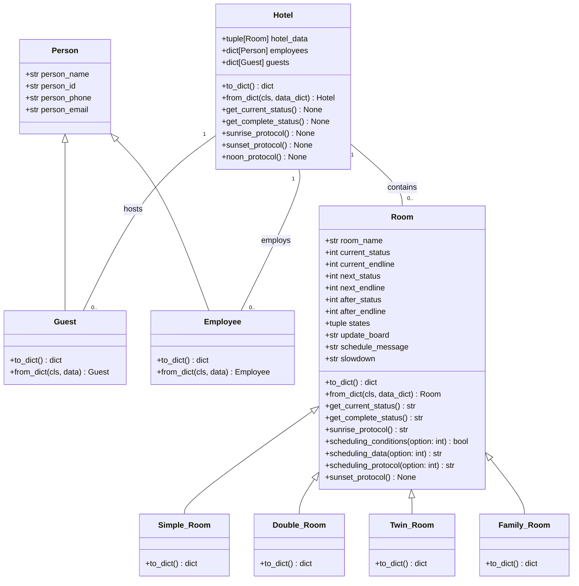

# Object Oriented Programming Project: Kairos Hotel
## Concept
The idea raises by looking for a OOP application, an aplication with an emphasis on information management and that it was motivating for the Python coding.
This hotel idea has a focus on representing the room management concept, being represented with predetermined variables, which are condensated in the Python classes designed for that: `Room` and `Hotel`
## Class Diagram


## **The `Room` class**
### Definition
```python
class Room():
    definition: str = "A part or division of a building enclosed by walls, floor, and ceiling"
    def __init__(self, room_data: list = None):

        if room_data is None:
            room_data = ["NOINFO", 0, 0, 0, 0, 0, 0]
        self.room_name = room_data[0]
        self.current_status = room_data[1]
        self.current_endline = room_data[2]
        self.next_status = room_data[3]
        self.next_endline = room_data[4]
        self.after_status = room_data[5]
        self.after_endline = room_data[6]
```
As we can see, `Room`'s `__init__`  is represented by `room_data`, a `list`, this is designed like that because by the moment, is easier to ad objects to a undetermined length list than define each one at the `__init__`, so let's see what exactly is a Room in this project:

| `Room.room_data` index | `self.` Attribute | Description |
| ------------ | ------------ | ------------ |
| `room_data[0]` | `room_name` | A `str` that identifies the room |
| `room_data[1]` | `current_status` | An `int` that represents the current "activity" of the room |
| `room_data[2]` | `current_endline` | An `int` that represent the current "activity" days left to end |
| `room_data[3]` | `next_status` | An `int` that represents the "next activity" of the room |
| `room_data[4]` | `next_endline` | An `int` that represent the "next activity" days left to end |
| `room_data[5]` | `after_status` | An `int` that represents the "after activity" of the room |
| `room_data[6]` | `after_endline` | An `int` that represent the "after activity" days left to end |

You may notice the "An `int` that represents the activity of the room" quote, that refers to one of the atributes those are independent of `room_data`:

```python
self.states = ("NOINFO", "AVAILABLE", "RESERVED", "OCCUPIED", "CLEANING", "MAINTENANCE", "DISABLED")
self.update_board = f" STATUS          TO DO\n
                      {self.states[1]}       press 1\n
                      {self.states[2]}        press 2\n
                      {self.states[3]}        press 3\n
                      {self.states[4]}        press 4\n
                      {self.states[5]}     press 5\n
                      {self.states[6]}        press 6\n"
self.schedule_message = "Write the days to schedule"
self.slowdown = "\n\t...\t...\t...\t..."
```
Let's see:
| `self.` Attribute | Description |
| ------------ | ------------ |
| `states` | All three `_status` attributes refers to the `self.states` index. |
| `update_board` | Used in the methods those modifies `_status` and `_endline` attributes. |
| `schedule_message` |Used in the methods those modifies `_status` and `_endline` attributes. |
| `slowdown` | An artificial delay in the methods execution for testing quality purposes. |

### The `Room` Methods
```python
def get_current_status(self) -> str:   
    #...
    #code
       
def get_complete_status(self) -> str:
    #...
    #code

def sunrise_protocol(self) -> str:
    #...
    #code
    #...
    #more code
    #...
    #even more code
    #...

def scheduling_conditions(self, option: int) -> bool:
    #...
    #code
    #...
    #more code
    #...
    #even more code
    #...

def def scheduling_data(self, option: int) -> str:
    #...
    #code
    #...
    #more code
    #...
    #even more code
    #...

def scheduling_protocol(self, option: int) -> str:
    #...
    #code
    #...
    #more code
    #...
    #even more code
    #...

def sunset_protocol(self) -> None:
    #...
    #code
```
**The complete code is below:**

- `get_current_status(self)`
<details><summary>Details</summary>
<p>
  
  ```python
  def get_current_status(self) -> str:   
        return f"{self.room_name}: \t {self.states[self.current_status]}."
  ```
  Only returns the `current_status` of the room

</p>
</details>


- `get_complete_status(self)`
<details><summary>Details</summary>
<p>
  
  ```python
  def get_complete_status(self) -> str:   
        return f"{self.room_name}:    {self.states[self.current_status]}    {self.current_endline} days left  -->  {self.states[self.next_status]}    {self.next_endline} days next  -->  {self.states[self.after_status]}    {self.after_endline} days after."

  ```
  Returns `current_status`, `next_status`, `after_status` and `_endline`'s of the room
</p>
</details>


- `sunrise_protocol(self)`
<details><summary>Details</summary>
<p>
  
  ```python
  def sunrise_protocol(self) -> str:
        status_update = f"{self.room_name}: no information was found, please check.{self.slowdown}" 
        
        if self.current_endline > 0:                                 #returns current_status and current_endline
            status_update = f"{self.room_name} is {self.states[self.current_status]}, {self.current_endline} days left.{self.slowdown}"

        elif self.current_endline == 0 and self.next_endline > 0:    #current_status finished and next_status exist
            status_update = f"{self.room_name} went from {self.states[self.current_status]} to {self.states[self.next_status]}.{self.slowdown}"
            self.current_status, self.current_endline = self.next_status, self.next_endline
            self.next_status, self.next_endline = self.after_status, self.after_endline
            self.after_status, self.after_endline = 0, 0
      
        elif self.current_endline == 0 and self.next_endline == 0:    #current_status finished and next_state doesn't exist
            update_notice = int(input(f"{self.room_name} finished {self.states[self.current_status]}, an update is needed:\n{self.update_board}\t\t  --> "))

            if update_notice == 1:      #the room becomes AVAILABLE for one day
                self.current_status, self.current_endline = 1, 1
                status_update = f"{self.room_name} is now {self.states[self.current_status]}.{self.slowdown}"

            elif update_notice == 2:     #the room becomes RESERVED, then OCCUPIED
                schedule_update_1 = int(input(f"{self.states[2]}:  {self.schedule_message}\n  --> "))
                self.current_status, self.current_endline = 2, schedule_update_1
                schedule_update_2 = int(input(f"{self.states[3]}:  {self.schedule_message}\n  --> "))
                self.next_status, self.next_endline = 3, schedule_update_2
                status_update = f"{self.room_name} is now {self.states[self.current_status]}.{self.slowdown}"
       
            elif update_notice == 3:    #the room becomes OCCUPIED, then one CLEANING day
                schedule_update_1 = int(input(f"{self.states[3]}:  {self.schedule_message}\n  --> "))
                self.current_status, self.current_endline = 3, schedule_update_1
                self.next_status, self.next_endline = 4, 1
                status_update = f"{self.room_name} is now {self.states[self.current_status]}.{self.slowdown}"
   
            elif update_notice == 4:    #the room has one CLEANING day, the next one day becomes AVAILABLE
                self.current_status, self.current_endline = 4, 1
                self.next_status, self.next_endline = 1, 1
                status_update = f"{self.room_name} is now {self.states[self.current_status]}.{self.slowdown}"

            elif update_notice == 5:    #the room is now on MAINTENANCE, the next one day becomes CLEANING
                schedule_update_1 = int(input(f"{self.states[5]}:  {self.schedule_message}\n  --> "))
                self.current_status, self.current_endline = 5, schedule_update_1
                self.next_status, self.next_endline = 4, 1
                status_update = f"{self.room_name} is now {self.states[self.current_status]}.{self.slowdown}"
           
            elif update_notice == 6:    #the room is now DISABLED, the following status requires an update
                schedule_update_1 = int(input(f"{self.states[6]}:  {self.schedule_message}\n  --> "))
                self.current_status, self.current_endline = 6, schedule_update_1
                update_notice = int(input(f"{self.room_name} is now {self.states[self.current_status]}, the next status needs to be updated:\n{self.update_board}"))
                schedule_update_2 = int(input(f"{self.states[update_notice]}:  {self.schedule_message}\n  --> "))
                self.next_status, self.next_endline = update_notice, schedule_update_2
                status_update = f"{self.room_name} becomes {self.states[self.current_status]}.{self.slowdown}"
                
        return status_update

  ```
  This one checks if `current_status` has finished, if `next_status` doesn't exist, requires an update.
  | Variables | Description |
  | ------------ | ------------ |
  | `status_update` | Is the method's `str` return, modified by the conditionals |
  | `update_notice` | An `int(input())`, is the method's conditional |
  | `schedule_update_1` | An `int(input())`, the new `current_endline` attribute value. |
  | `schedule_update_2` | An `int(input())`, the new `next_endline` attribute value. |

</p>
</details>


- `scheduling_conditions(self, option)`
<details><summary>Details</summary>
<p>
  
  ```python
  def scheduling_conditions(self, option: int) -> bool:
        conditions = {"c_status_eq1__n_endline_eq0": self.current_status == 1 and self.next_endline == 0,
                      "c_status_geq1__n_endline_eq0": self.current_status >= 1 and self.next_endline == 0,
                      "n_status_eq1__a_endline_eq0": self.next_status == 1 and self.after_endline == 0,
                      "n_status_geq1__a_endline_eq0": self.next_status >= 1 and self.after_endline == 0,
                      "a_status_eq1": self.after_status == 1,
                      "c_status_eq3__n_endline_eq0": self.current_status == 3 and self.next_endline == 0,
                      "n_status_eq3__a_endline_eq0": self.next_status == 3 and self.after_endline == 0,
                      "c_status_neq4__a_endline_eq1": self.current_status != 4 and self.next_status == 1 and self.after_endline == 0,
                      "n_status_neq4__a_status_eq1": self.next_status != 4 and self.after_status == 1,
                      "c_status_eq5__n_endline_eq0": self.current_status == 5 and self.next_endline == 0,
                      "n_status_eq5__a_endline_eq0": self.next_status == 5 and self.after_endline == 0,
                      "c_status_eq6__n_endline_eq0": self.current_status == 6 and self.next_endline == 0,
                      "n_status_eq6__a_endline_eq0": self.next_status == 6 and self.after_endline == 0,
                      "c_status_l6__n_endline_eq0": self.current_status < 6 and self.next_endline == 0,
                      "n_status_l6__a_endline_eq0": self.next_status < 6 and self.after_endline == 0}
         
        conditional_status = [["c_status_eq1__n_endline_eq0", "c_status_geq1__n_endline_eq0", "n_status_eq1__a_endline_eq0"],
                              ["c_status_eq1__n_endline_eq0", "c_status_geq1__n_endline_eq0", "n_status_eq1__a_endline_eq0", "n_status_geq1__a_endline_eq0", "a_status_eq1"],
                              ["c_status_eq3__n_endline_eq0", "n_status_eq3__a_endline_eq0", "c_status_eq5__n_endline_eq0", "n_status_eq5__a_endline_eq0", "c_status_eq6__n_endline_eq0", "n_status_eq6__a_endline_eq0"],
                              ["c_status_eq1__n_endline_eq0", "c_status_neq4__a_endline_eq1", "n_status_neq4__a_status_eq1", "c_status_eq3__n_endline_eq0", "n_status_eq3__a_endline_eq0", "c_status_eq6__n_endline_eq0", "n_status_eq6__a_endline_eq0"],
                              ["c_status_eq1__n_endline_eq0", "n_status_eq1__a_endline_eq0", "a_status_eq1", "c_status_l6__n_endline_eq0", "n_status_l6__a_endline_eq0"]]

        room_conditions = conditional_status[option - 1]
        return any(conditions[c] for c in room_conditions)
  ```
  | Objects | Description |
  | ------------ | ------------ |
  | `conditions` | A `dict`, each element is a conditional identified by a codified name  |
  | `conditional_status` | A `list`'s `list` with the `conditions[key]` those aplies to `states`' elements, excepting `AVAILABLE`  |
  | `room_conditions` | Uses the `option` `int(input())` to identify the scheduling command |

  The `any()` function and by extension, this method returns True if any conditional in `room_conditions` are true, otherwise it returns False.
  ```python
  return any(conditions[c] for c in room_conditions)
  ```

</p>
</details>


- `scheduling_data(self, option)`
<details><summary>Details</summary>
<p>
  
  ```python
  def scheduling_data(self, option: int) -> str:
        schedule_type = (f"{self.room_name}: no information was found, please check", 
                         f"{self.room_name}: ({self.definition})  -->  RIGHT NOW",
                         f"{self.room_name}: ({self.definition})  -->  {self.current_endline} DAYS",
                         f"{self.room_name}: ({self.definition})  -->  {self.current_endline + self.next_endline} DAYS",
                         f"{self.room_name}:       {self.states[self.current_status]}        -->  RIGHT NOW",
                         f"{self.room_name}:       {self.states[self.current_status]}        -->  {self.current_endline} DAYS",
                         f"{self.room_name}: {self.states[self.current_status]} --- {self.states[self.next_status]}  -->  {self.current_endline + self.next_endline} DAYS")

        schedule_data = schedule_type[0]

        conditions = {1: [(self.current_status == 1 and self.next_endline == 0, schedule_type[1]),
                          (self.current_status >= 1 and self.next_endline == 0, schedule_type[2]),
                          (self.next_status == 1 and self.after_endline == 0, schedule_type[2])],
                      2: [(self.current_status == 1 and self.next_endline == 0, schedule_type[1]),
                          (self.current_status >= 1 and self.next_endline == 0, schedule_type[2]),
                          (self.next_status == 1 and self.after_endline == 0, schedule_type[2]),
                          (self.next_status >= 1 and self.after_endline == 0, schedule_type[3]),
                          (self.after_status == 1, schedule_type[3])],
                      3: [(self.current_status == 3 and self.next_endline == 0, schedule_type[5]),
                          (self.next_status == 3 and self.after_endline == 0, schedule_type[6]),
                          (self.current_status == 5 and self.next_endline == 0, schedule_type[5]),
                          (self.next_status == 5 and self.after_endline == 0, schedule_type[6]),
                          (self.current_status == 6 and self.next_endline == 0, schedule_type[5]),
                          (self.next_status == 6 and self.after_endline == 0, schedule_type[6])],
                      4: [(self.current_status == 1 and self.next_endline == 0, schedule_type[4]),
                          (self.next_status == 1 and self.after_endline == 0, schedule_type[5]),
                          (self.after_status == 1, schedule_type[6]),
                          (self.current_status == 3 and self.next_endline == 0, schedule_type[5]),
                          (self.next_status == 3 and self.after_endline == 0, schedule_type[6]),
                          (self.current_status == 6 and self.next_endline == 0, schedule_type[5]),
                          (self.next_status == 6 and self.after_endline == 0, schedule_type[6])],
                      5: [(self.current_status == 1 and self.next_endline == 0, schedule_type[4]),
                          (self.next_status == 1 and self.after_endline == 0, schedule_type[5]),
                          (self.after_status == 1, schedule_type[6]),
                          (self.current_status < 6 and self.next_endline == 0, schedule_type[5]),
                          (self.next_status < 6 and self.after_endline == 0, schedule_type[6])]}

        for condition, result in conditions.get(option, []):
            if condition:
                schedule_data = result
                break
            
        return schedule_data
  ```
  | Objects | Description |
  | ------------ | ------------ |
  | `schedule_type` | A `tuple` with the posible returns |
  | `schedule_data` | Is the method's `str` return, modified by the conditionals |
  | `conditions` | A `dict`, each element relates the `option` `int(input())` values with a `list` of `tuple`: a conditional, and a `schedule_type` item |

  The `for condition, result in conditions.get(option, []):` statement checks the `list` of `tuple` asignated by `option`, returns the `schedule_type` item if the condition is `True`.
  ```python
  for condition, result in conditions.get(option, []):
      if condition:
          schedule_data = result
          break
            
  return schedule_data
  ```

</p>
</details>


- `scheduling_protocol(self, option)`
<details><summary>Details</summary>
<p>
  
  ```python
  def scheduling_protocol(self, option: int) -> str:
        status_update = f"{self.room_name}: no information was found, please check.{self.slowdown}"

        if option == 1:         #RESERVE
            #updates one room with the RESERVED status and the subsequent OCCUPIED status
            schedule_update_1 = int(input(f"{self.states[2]}:  {self.schedule_message}\n  --> "))
            schedule_update_2 = int(input(f"{self.states[3]}:  {self.schedule_message}\n  --> "))

            if self.current_status == 1 and self.next_endline == 0:
                #the room is AVAILABLE right now and there is no posterior time limit
                self.current_status, self.current_endline = 2, schedule_update_1
                self.next_status, self.next_endline = 3, schedule_update_2

            elif self.current_status >= 1 and self.next_endline == 0:
                #the room is in a non-AVAILABLE state right now and there is no posterior time limit
                self.next_status, self.next_endline = 2, schedule_update_1
                self.after_status, self.after_endline = 3, schedule_update_2

            elif self.next_status == 1 and self.after_endline == 0:
                #the room will be AVAILABLE right after and there is no posterior time limit
                self.next_status, self.next_endline = 2, schedule_update_1
                self.after_status, self.after_endline = 3, schedule_update_2

            status_update = f"{self.room_name} has been {self.states[2]}.{self.slowdown}"
            
        elif option == 2:         #OCCUPY
            #updates one room with the subsequent OCCUPIED status
            schedule_update_1 = int(input(f"{self.states[3]}:  {self.schedule_message}\n  --> "))

            if self.current_status == 1 and self.next_endline == 0:
                #the room current_status is AVAILABLE and next_status has no time limit or is unexistent
                self.current_status, self.current_endline = 3, schedule_update_1

            elif self.current_status >= 1 and self.next_endline == 0:
                #the room current_status is non-AVAILABLE and next_status has no time limit or is unexistent
                self.next_status, self.next_endline = 3, schedule_update_1

            elif self.next_status == 1 and self.after_endline == 0:
                #the room next_status is AVAILABLE and after_status has no time limit or is unexistent
                self.next_status, self.next_endline = 3, schedule_update_1

            elif self.next_status >= 1 and self.after_endline == 0:
                #the room next_status is non-AVAILABLE and after_status has no time limit or is unexistent
                self.after_status, self.after_endline = 3, schedule_update_1

            elif self.after_status == 1:
                #the room after_status is AVAILABLE
                self.after_status, self.after_endline = 3, schedule_update_1

            status_update = f"{self.room_name} has been {self.states[3]}.{self.slowdown}"

        elif option == 3:         #CLEANING
            #updates one room with the CLEANING status
            schedule_update_1 = int(input(f"{self.states[4]}:  {self.schedule_message}\n  --> "))

            if self.current_status == 3 and self.next_endline == 0:
                #the room current_status is OCCUPIED and next_status has no time limit or is unexistent
                self.next_status, self.next_endline = 4, schedule_update_1

            elif self.next_status == 3 and self.after_endline == 0:
                #the room next_status is OCCUPIED and after_status has no time limit or is unexistent
                self.after_status, self.after_endline = 4, schedule_update_1

            elif self.current_status == 5 and self.next_endline == 0:
                #the room current_status is MAINTENANCE and next_status has no time limit or is unexistent
                self.next_status, self.next_endline = 4, schedule_update_1

            elif self.next_status == 5 and self.after_endline == 0:
                #the room next_status is MAINTENANCE and after_status has no time limit or is unexistent
                self.after_status, self.after_endline = 4, schedule_update_1

            elif self.current_status == 6 and self.next_endline == 0:
                #the room current_status is DISABLED and next_status has no time limit or is unexistent
                self.next_status, self.next_endline = 4, schedule_update_1

            elif self.next_status == 6 and self.after_endline == 0:
                #the room next_status is DISABLED and after_status has no time limit or is unexistent
                self.after_status, self.after_endline = 4, schedule_update_1

            status_update = f"{self.room_name} has scheduled a {self.states[4]}.{self.slowdown}"

        elif option == 4:         #MAINTENANCE
            #updates one room with the MAINTENANCE status
            schedule_update_1 = int(input(f"{self.states[5]}:  {self.schedule_message}\n  --> "))

            if self.current_status == 1 and self.next_endline == 0:
                #the room current_status is AVAILABLE and next_status has no time limit or is unexistent
                self.current_status, self.current_endline = 5, schedule_update_1

            elif self.next_status == 1 and self.after_endline == 0:
                #the room next_status is AVAILABLE and after_status has no time limit or is unexistent
                self.next_status, self.next_endline = 5, schedule_update_1

            elif self.after_status == 1:
            #the room after_status is AVAILABLE
                self.after_status, self.after_endline = 5, schedule_update_1

            elif self.current_status == 3 and self.next_endline == 0:
                #the room current_status is OCCUPIED and next_status has no time limit or is unexistent
                self.next_status, self.next_endline = 5, schedule_update_1

            elif self.next_status == 3 and self.after_endline == 0:
                #the room next_status is OCCUPIED and after_status has no time limit or is unexistent
                self.after_status, self.after_endline = 5, schedule_update_1

            elif self.current_status == 6 and self.next_endline == 0:
                #the room current_status is DISABLED and next_status has no time limit or is unexistent
                self.next_status, self.next_endline = 5, schedule_update_1

            elif self.next_status == 6 and self.after_endline == 0:
                #the room next_status is DISABLED and after_status has no time limit or is unexistent
                self.after_status, self.after_endline = 5, schedule_update_1

            status_update = f"{self.room_name} has scheduled a {self.states[5]}.{self.slowdown}"


        elif option == 5:         #DISABLED
            #updates one room with the DISABLED status
            schedule_update_1 = int(input(f"{self.states[6]}:  {self.schedule_message}\n  --> "))

            if self.current_status == 1 and self.next_endline == 0:
                #the room current_status is AVAILABLE and next_status has no time limit or is unexistent
                self.current_status, self.current_endline = 6, schedule_update_1

            elif self.next_status == 1 and self.after_endline == 0:
            #the room next_status is AVAILABLE and after_status has no time limit or is unexistent
                self.next_status, self.next_endline = 6, schedule_update_1

            elif self.after_status == 1:
            #the room after_status is AVAILABLE
                self.after_status, self.after_endline = 6, schedule_update_1

            elif self.current_status < 6 and self.next_endline == 0:
                #the room current_status is non-DISABLED and next_status has no time limit or is unexistent
                self.next_status, self.next_endline = 6, schedule_update_1

            elif self.next_status < 6 and self.after_endline == 0:
                #the room next_status is non-DISABLED and after_status has no time limit or is unexistent
                self.after_status, self.after_endline = 6, schedule_update_1

            status_update = f"{self.room_name} has been {self.states[6]}.{self.slowdown}"

        return status_update
  ```
  | Objects | Description |
  | ------------ | ------------ |
  | `status_update` | Is the method's `str` return, modified by the conditionals |
  | `schedule_update_1` | An `int(input())`, the new `_endline` attribute value. |
  | `schedule_update_2` | An `int(input())`, the new `_endline` attribute value. |
  This method returns the updating of a room `_state` as a message, based in the same conditionals used above.
     
  This method has the structure that `scheduling_conditions()` and `scheduling_data()` used to have.

</p>
</details>


- `sunset_protocol(self)`
<details><summary>Details</summary>
<p>
  
  ```python
  def sunset_protocol(self) -> None:
        self.current_endline = self.current_endline - 1
  ```
  This method by the moment make `current_endline` decrease by one, represents the passing of a day.

</p>
</details>

### `Room`'s subclasses
```python
class Simple_Room(Room):
    definition: str = "Simple Bed, One Bathroom"
    def __init__(self, room_data: list = None):
        super().__init__(room_data)

class Double_Room(Room):
    definition: str = "Large Bed, One Bathroom"
    def __init__(self, room_data: list = None):
        super().__init__(room_data)

class Twin_Room(Room):
    definition: str = "Two Beds, Two Bathrooms"
    def __init__(self, room_data: list = None):
        super().__init__(room_data)

class Family_Room(Room):
    definition: str = "Three Beds, Two Bathrooms"
    def __init__(self, room_data: list = None):
        super().__init__(room_data)
```
For now are merely placeholders.


## **The `Hotel` class**
### Definition
```python
class Hotel():
    def __init__(self, hotel_data: tuple[Room, ...] = ()):
        self.hotel_data = hotel_data
```
Pretty simple, an `Hotel` object is composed by a `tuple` of `Room` objects by the `hotel_data` name. 

### The `Hotel` Methods
```python
def get_current_status(self) -> None:
    #...
    #code
    #... 

def get_complete_status(self) -> None:
    #...
    #code
    #... 

def sunrise_protocol(self) -> None:
    #...
    #code
    #... 

def sunset_protocol(self) -> None:
    #...
    #code
    #... 

def noon_protocol(self) -> None:
     #...
    #code
    #...
    #more code
    #...
    #even more code
    #...
```
You may notice the method's are apparently identical to the `Room` class methods, let's take a look to the complete code below:

- `get_current_status(self)`
<details><summary>Details</summary>
<p>
  
  ```python
  def get_current_status(self) -> None:
      print("  ROOM            STATUS")
      for room in self.hotel_data:
          print(room.get_current_status())
          time.sleep(1)   
  ```
  That's all, it delivers the `room.get_current_status()` for each room of the Hotel!.
  
  `time.sleep(1)` is an artificial delay in the method execution for testing quality purposes.

</p>
</details>


- `get_complete_status(self)`
<details><summary>Details</summary>
<p>
  
  ```python
  def get_complete_status(self) -> None:
      print("  ROOM            CURRENT STATUS                  NEXT STATUS                   AFTER STATUS")
      for room in self.hotel_data:
          print(room.get_complete_status())
          time.sleep(1)
  ```
  Almost the same concept as above, it delivers the `room.get_complete_status()` for each room of the Hotel.

</p>
</details>


- `sunrise_protocol(self)`
<details><summary>Details</summary>
<p>
  
  ```python
  def sunrise_protocol(self) -> None:
      for room in self.hotel_data:
          print(room.sunrise_protocol())
          time.sleep(2)
  ```
  This one deploys the `room.sunrise_protocol()` method for each room as a continuous read and write interaction.

</p>
</details>


- `noon_protocol(self)`
<details><summary>Details</summary>
<p>
  
  ```python
  def noon_protocol(self) -> None:
      option = int(input("\n""         OPTIONS                 TO DO" "\n"
                         "Reserve a Room                  press 1" "\n"
                         "Occupy a Room                   press 2" "\n"
                         "Schedule a Cleaning             press 3" "\n"
                         "Schedule a Maintenance          press 4" "\n"
                         "Disable a Room                  press 5" "\n"
                         "Return                          press 0" "\n"
                         "                                  -->  "))       

        if option == 0: pass

        if option > 0:                  
            booking_rooms = []
            for room in self.hotel_data:
                if room.scheduling_conditions(option) is True:
                    booking_rooms.append(room)
                else: pass

            if len(booking_rooms) > 0:
                print("  ROOM             INFORMATION             UNTIL      TO DO")
                for b_room in booking_rooms:
                    print(f"{b_room.scheduling_data(option)}  -->  press {(booking_rooms.index(b_room) + 1)}")
                    time.sleep(1)
                book = int(input("Cancel                                                  press 0" "\n"
                                "                                                       "" -->  "))
                if book > 0 and book <= len(booking_rooms):
                    print(booking_rooms[book - 1].scheduling_protocol(option))
                if book == 0:
                    pass

            else: print("There are no rooms available to schedule that option.")
  ```
  This method integrates `room.scheduling_conditions()`, `room.scheduling_data()` and `room.scheduling_protocol()` in a interactive mess to update in a room one `_status`.
  
  **This is how it works:**
  ```python
  option = int(input("\n""         OPTIONS                 TO DO" "\n"
                     "Reserve a Room                  press 1" "\n"
                     "Occupy a Room                   press 2" "\n"
                     "Schedule a Cleaning             press 3" "\n"
                     "Schedule a Maintenance          press 4" "\n"
                     "Disable a Room                  press 5" "\n"
                     "Return                          press 0" "\n"
                     "                                  -->  "))       
  ```
  `option` is a `int(input())` with a whole options menu as a argument.

  ```python
  if option == 0: pass    
  ```
  `option == 0` exits the "options menu interface" and goes back to the "main menu interface", we will see it in the `main` file section.
  
  ```python
  if option > 0:                 
      booking_rooms = []
      for room in self.hotel_data:
      if room.scheduling_conditions(option) is True:
          booking_rooms.append(room)
      else: pass  
  ```
  `booking_rooms` is a `list` composed by the `Room` objects which `scheduling_conditions(option)` is `True`, those are, the rooms that can be scheduled in the status chosen by the user. 

  ```python
  if len(booking_rooms) > 0:
      print("  ROOM             INFORMATION             UNTIL      TO DO")
      for b_room in booking_rooms:
          print(f"{b_room.scheduling_data(option)}  -->  press {(booking_rooms.index(b_room) + 1)}")
          time.sleep(1)
  ```
  This section checks if `booking_rooms` has elements and shows the information provided by `room.scheduling_data(option)` as a options menu of the rooms those can be scheduled.

  ```python
  book = int(input("Cancel                                                  press 0" "\n"
                   "                                                       "" -->  "))
      if book > 0 and book <= len(booking_rooms):
          print(booking_rooms[book - 1].scheduling_protocol(option))
      if book == 0:
          pass
  ```
  `book` is the `int(input())` used to "choose" the room to schedule, consequently, shows the `_state` updating information provided by `room.scheduling_protocol(option)` for the chosen room.
  
</p>
</details>    


## **The `main.py` file**
### The `main()`
```python
from kairos_packages.room_cls import Simple_Room, Double_Room, Twin_Room, Family_Room
from kairos_packages.hotel_cls import Hotel

def main():
    print("\t""-------------------""\n""\t""KAIROS HOTEL SYSTEM""\n""\t""-------------------")
    while True:
        program = int(input("\n""         OPTIONS                 TO DO" "\n"
                            "Current Status of the Hotel     press 1" "\n"
                            "Complete Status of the Hotel    press 2" "\n"
                            "Check Room Status               press 3" "\n"
                            "Specific Tasks                  press 4" "\n"
                            "End the Day                     press 5" "\n"
                            "Exit                            press 0" "\n"
                            "\t""\t""\t""\t"" -->  "))

        if program == 0: break    

        elif program == 1:    
            KAIROS.get_current_status()

        elif program == 2:           
            KAIROS.get_complete_status()
                
        elif program == 3:          
            KAIROS.sunrise_protocol()

        elif program == 4:            
            KAIROS.noon_protocol()

        elif program == 5:         
            KAIROS.sunset_protocol()

if __name__ == "__main__": 
    main()
```
A very simple file, with a `while` loop, that allows to interact continuously with `program` `int(input())`, it has the "main menu" as the argument"


# **The json update**
Looking forward to add a `Person` class became necesary to locate the `KAIROS` `Hotel` and `Room` objects in an external file, instead of being in the `main` file:
```python
R101 = Simple_Room(["Room 101", 3, 1, 1, 1, 0, 0])
R102 = Simple_Room(["Room 102", 2, 2, 3, 3, 0, 0])
R103 = Double_Room(["Room 103", 4, 1, 5, 2, 0, 0])
R104 = Double_Room(["Room 104", 3, 3, 2, 1, 3, 4])

R201 = Simple_Room(["Room 201", 3, 0, 4, 1, 0, 0])
R202 = Simple_Room(["Room 202", 5, 2, 0, 0, 0, 0])
R203 = Twin_Room(["Room 203", 5, 0, 6, 2, 3, 3])
R204 = Twin_Room(["Room 204", 0, 0, 0, 0, 0, 0])

R301 = Double_Room(["Room 301", 2, 3, 3, 3, 5, 2])
R302 = Double_Room(["Room 302", 6, 2, 4, 2, 1, 1])
R303 = Family_Room(["Room 303", 4, 2, 1, 1, 0, 0])
R304 = Family_Room(["Room 304", 1, 1, 0, 0, 0, 0])

KAIROS = Hotel((R101, R102, R103, R104, R201, R202, R203, R204, R301, R302, R303, R304))
```
So, it was necesary to redefine some aspects of `Hotel` and `Room` class to made the conversion to a **json** compatible format. But first, there is the `Person` class:

## The `Person` class
**At the moment Person class related methods are only utilized to make Python Objects into json format**
### Definition
```python
class Person():
    def __init__(self, person_data: list = None):
        if person_data is None:
            person_data = [("NO_LAST_NAME", "NO_FIRST_NAME"), "id_number", "tel_number", "username@server.domain"]
        self.person_name = person_data[0]
        self.person_id = person_data[1]
        self.person_phone = person_data[2]
        self.person_email = person_data[3]

class Guest(Person):
    def __init__(self, person_data: list = None):
        super().__init__(person_data)
        if person_data is None:
            person_data = [("NO_LAST_NAME", "NO_FIRST_NAME"), "id_number", "tel_number", "username@server.domain", "guest_adress", "mm/dd/yyyy"]
        self.guest_adress = person_data[4]
        self.guest_birthday = person_data[5]

class Employee(Person):
    def __init__(self, person_data: list = None):
        super().__init__(person_data)
        if person_data is None:
            person_data = [("NO_LAST_NAME", "NO_FIRST_NAME"), "id_number", "tel_number", "username@server.domain", "job_title", "employee_code"]
        self.employee_role = person_data[4]
        self.employee_id = person_data[5]
```
`Person`'s `__init__`  is represented by `person_data`, a `list`, this is designed like that because by the moment, is easier to ad objects to a undetermined length list than define each one at the `__init__`, so let's see what exactly is a Person, Guest and a Employee in this project:

`Person`
| `Person.person_data` index | `self.` Attribute | Description |
| ------------ | ------------ | ------------ |
| `person_data[0]` | `person_name` | A `tuple` that identifies the person last and first name |
| `person_data[1]` | `person_id` | A `str` that represents the person identification number |
| `person_data[2]` | `person_phone` | A `str` that represents the person cellphone number |
| `person_data[3]` | `person_email` | A `str` that represents the person email address |

`Guest`
| `Guest.person_data` index | `self.` Attribute | Description |
| ------------ | ------------ | ------------ |
| `person_data[4]` | `guest_adress` |  A `str` that represents the guest residence address |
| `person_data[5]` | `guest_birthday` | A `str` that represents the guest birtday date |

`Employee`
| `Employee.person_data` index | `self.` Attribute | Description |
| ------------ | ------------ | ------------ |
| `person_data[4]` | `employee_role` |  A `str` that represents the employee role |
| `person_data[5]` | `employee_id` | A `str` that represents the employee's id code |


## Updated `Hotel` class
```python
class Hotel():
    def __init__(self, hotel_data: tuple[Room, ...] = (), employees: dict = None, guests: dict = None):
        self.hotel_data = hotel_data
        self.employees = employees
        self.guests = guests
```
So, the Hotel's employees and guests data are two separated `dict` objects.

### The new actual hotel
The `Room` objects are unaltered.
```python
R101 = Simple_Room(["Room 101", 3, 1, 1, 1, 0, 0])
R102 = Simple_Room(["Room 102", 2, 2, 3, 3, 0, 0])
R103 = Double_Room(["Room 103", 4, 1, 5, 2, 0, 0])
R104 = Double_Room(["Room 104", 3, 3, 2, 1, 3, 4])

R201 = Simple_Room(["Room 201", 3, 0, 4, 1, 0, 0])
R202 = Simple_Room(["Room 202", 5, 2, 0, 0, 0, 0])
R203 = Twin_Room(["Room 203", 5, 0, 6, 2, 3, 3])
R204 = Twin_Room(["Room 204", 0, 0, 0, 0, 0, 0])

R301 = Double_Room(["Room 301", 2, 3, 3, 3, 5, 2])
R302 = Double_Room(["Room 302", 6, 2, 4, 2, 1, 1])
R303 = Family_Room(["Room 303", 4, 2, 1, 1, 0, 0])
R304 = Family_Room(["Room 304", 1, 1, 0, 0, 0, 0])
```

The `employees` `dict` relates the employee's `employee_role` attribute with the actual `Employee` object.
```python
employees = {"NOINFO": Employee([("NOLASTNAME", "NOFIRSTNAME"), "0000000000", "000-0000", "username@server.domain", "NOINFO", "E000"]),
             "Receptionist": Employee([("Garcia", "Laura"), "0012345678", "555-0101", "laura.garcia@hotel.com", "Receptionist", "E001"]),
             "Housekeeper": Employee([("Smith", "John"), "0023456789", "555-0202", "john.smith@hotel.com", "Housekeeper", "E002"]),
             "Concierge": Employee([("Doe", "Jane"), "0034567890", "555-0303", "jane.doe@hotel.com", "Concierge", "E003"]),
             "Chef": Employee([("Williams", "Emily"), "0056789012", "555-0505", "emily.williams@hotel.com", "Chef", "E004"]),
             "Maintenance Worker": Employee([("Martinez", "Carlos"), "0067890123", "555-0606", "carlos.martinez@hotel.com", "Maintenance Worker", "E005"]),
             "General Manager": Employee([("Davis", "Kevin"), "0089012345", "555-0808", "kevin.davis@hotel.com", "General Manager", "E006"]),
             "Front Desk Manager": Employee([("Rodriguez", "Angela"), "0090123456", "555-0909", "angela.rodriguez@hotel.com", "Front Desk Manager", "E007"]),
             "Security Officer": Employee([("Lee", "Daniel"), "0101234567", "555-1010", "daniel.lee@hotel.com", "Security Officer", "E008"])}
```

The `guests` `dict` relates the room's `room_name` attribute with three `Person` objects, that represents the by now unexistent attributes `current_person`, `next_person` y `after_person`, related but independent to the `Room` attributes.
```python
guests = {"Room 101": (Guest([("Smith", "John"), "987654321", "555-9876", "john.smith@example.com", "123 Elm St", "03/25/1985"]),
                       employees["Housekeeper"],
                       employees["NOINFO"]),
          "Room 102": (Guest([("Doe", "Jane"), "123456789", "555-1234", "jane.doe@example.com", "456 Oak St", "07/14/1990"]), 
                       Guest([("Doe", "Jane"), "123456789", "555-1234", "jane.doe@example.com", "456 Oak St", "07/14/1990"]),
                       employees["NOINFO"]),
          "Room 103": (employees["Concierge"],
                       employees["Maintenance Worker"],
                       employees["NOINFO"]),
          "Room 104": (Guest([("Johnson", "Michael"), "234567891", "555-2345", "michael.johnson@example.com", "789 Pine St", "11/02/1975"]),
                       Guest([("Brown", "Emily"), "345678912", "555-3456", "emily.brown@example.com", "101 Maple St", "05/16/1982"]),
                       Guest([("Brown", "Emily"), "345678912", "555-3456", "emily.brown@example.com", "101 Maple St", "05/16/1982"])),
          "Room 201": (Guest([("Williams", "David"), "456789123", "555-4567", "david.williams@example.com", "202 Cedar St", "09/10/1988"]),
                       employees["Concierge"],
                       employees["NOINFO"]),
          "Room 202": (employees["Maintenance Worker"],
                       employees["NOINFO"],
                       employees["NOINFO"]),
          "Room 203": (employees["Maintenance Worker"],
                     employees["Front Desk Manager"],
                     Guest([("Jones", "Sarah"), "567891234", "555-5678", "sarah.jones@example.com", "303 Birch St", "12/30/1992"])),
          "Room 204": (employees["NOINFO"],
                       employees["NOINFO"],
                       employees["NOINFO"]),
          "Room 301": (Guest([("Garcia", "Carlos"), "678912345", "555-6789", "carlos.garcia@example.com", "404 Spruce St", "08/20/1983"]),
                       Guest([("Garcia", "Carlos"), "678912345", "555-6789", "carlos.garcia@example.com", "404 Spruce St", "08/20/1983"]),
                       employees["Maintenance Worker"]),
          "Room 302": (employees["Front Desk Manager"],
                       employees["Concierge"],
                       employees["Housekeeper"]),
          "Room 303": (employees["Concierge"],
                       employees["Housekeeper"],
                       employees["NOINFO"]),
          "Room 304": (employees["Housekeeper"],
                       employees["NOINFO"],
                       employees["NOINFO"])}
```

## **The json Conversion**
Each class, now has the brand new `to_dict` and `from_dict` methods:
- `to_dict`, returns a `dict` version of the object.
- `from_dict`, returns a conversion of a `dict` into the class object.

### `Person`
<details><summary>Details</summary>
<p>
  
  ```python
  class Guest(Person):
    def to_dict(self) -> dict:
        return {"person_name": {"last": self.person_name[0],
                                "first": self.person_name[1]},
                "person_id": self.person_id,
                "person_phone": self.person_phone,
                "person_email": self.person_email,
                "guest_adress": self.guest_adress,
                "guest_birthday": self.guest_birthday}
    @classmethod
    def from_dict(cls, data):
        employee_data = [(data["person_name"]["last"], data["person_name"]["first"]),
                          data["person_id"],
                          data["person_phone"],
                          data["person_email"],
                          data["guest_adress"],
                          data["guest_birthday"]]
        return cls(employee_data)


class Employee(Person):
    def to_dict(self) -> dict:
        return {"person_name": self.person_name,
                "person_id": self.person_id,
                "person_phone": self.person_phone,
                "person_email": self.person_email,
                "employee_role": self.employee_role,
                "employee_id": self.employee_id}
    @classmethod
    def from_dict(cls, data):
        employee_data = [data["person_name"],
                            data["person_id"],
                            data["person_phone"],
                            data["person_email"],
                            data["employee_role"],
                            data["employee_id"]]
        return cls(employee_data)
  ```

</p>
</details>


### `Room`
<details><summary>Details</summary>
<p>
  
  ```python
  class Room():
    def to_dict(self) -> dict:
        return {"room_name": self.room_name,
                "current_status": self.current_status,
                "current_endline": self.current_endline,
                "next_status": self.next_status,
                "next_endline": self.next_endline,
                "after_status": self.after_status,
                "after_endline": self.after_endline}
    @classmethod
    def from_dict(cls, data_dict):
        room_data = [data_dict["room_name"],
                     data_dict["current_status"],
                     data_dict["current_endline"],
                     data_dict["next_status"],
                     data_dict["next_endline"],
                     data_dict["after_status"],
                     data_dict["after_endline"]]
        return cls(room_data)
  ```

</p>
</details>


### `Hotel`
<details><summary>Details</summary>
<p>
  This the most complex of all, enables the whole conversion of the hotel.
    
  ```python
  class Hotel():   
    def to_dict(self) -> dict:
        return {"hotel_data": [room.to_dict() for room in self.hotel_data], 
                "employees": {role: emp.to_dict() for role, emp in self.employees.items()},
                "guests": {room_name: [guest.to_dict() if isinstance(guest, Guest) else {"employee_role": guest.employee_role} for guest in guests_list]
                           for room_name, guests_list in self.guests.items()}}
    @classmethod
    def from_dict(cls, data_dict):
        room_objects = []
        for room_data in data_dict["hotel_data"]:
            room_type = room_data.pop("type")
            if room_type == "Simple_Room":
                room_objects.append(Simple_Room.from_dict(room_data))
            elif room_type == "Double_Room":
                room_objects.append(Double_Room.from_dict(room_data))
            elif room_type == "Twin_Room":
                room_objects.append(Twin_Room.from_dict(room_data))
            elif room_type == "Family_Room":
                room_objects.append(Family_Room.from_dict(room_data))
            else:
                raise ValueError(f"Unknown room type: {room_type}")
            
        employees = {role: Employee.from_dict(emp_data) for role, emp_data in data_dict.get("employees", {}).items()}
        
        guests = {}
        for room_name, guests_list in data_dict.get("guests", {}).items():
            guests[room_name] = []
            for guest_data in guests_list:
                if "employee_role" in guest_data:
                    # Find the employee object by matching employee role
                    employee = next(emp for emp in employees.values() if emp.employee_role == guest_data["employee_role"])
                    guests[room_name].append(employee)
                else:
                    guests[room_name].append(Guest.from_dict(guest_data))

        return cls(tuple(room_objects), employees, guests)
  ```

</p>
</details>


### **The Actual json conversion**
```python
import json
from kairos_packages.room_cls import Simple_Room, Double_Room, Twin_Room, Family_Room
from kairos_packages.hotel_cls import Hotel
from kairos_packages.person_cls import Guest, Employee

def main():
    while True:
        program = int(input("))
        elif program == 5:            #end the "day" + JSON TEST      
            with open('KAIROS_data.json', 'r+') as json_file:          
                KAIROS_data = KAIROS.to_dict()    
                json.dump(KAIROS_data, json_file, indent=4)
                KAIROS.sunset_protocol()

if __name__ == "__main__": 
    main()
```

As you can see, if `program == 5 is True` appears three new lines of code, in this case based on "The new actual hotel" information located in the `main` file, that does the `Hotel` class conversion to `dict` and with that object, builds a **.json** file.


<details><summary>KAIROS_data.json</summary>
<p>  
    
  ```json
  {
    "hotel_data": [
        {
            "room_name": "Room 101",
            "current_status": 3,
            "current_endline": 1,
            "next_status": 1,
            "next_endline": 1,
            "after_status": 0,
            "after_endline": 0,
            "type": "Simple_Room"
        },
        {
            "room_name": "Room 102",
            "current_status": 2,
            "current_endline": 2,
            "next_status": 3,
            "next_endline": 3,
            "after_status": 0,
            "after_endline": 0,
            "type": "Simple_Room"
        },
        {
            "room_name": "Room 103",
            "current_status": 4,
            "current_endline": 1,
            "next_status": 5,
            "next_endline": 2,
            "after_status": 0,
            "after_endline": 0,
            "type": "Double_Room"
        },
        {
            "room_name": "Room 104",
            "current_status": 3,
            "current_endline": 3,
            "next_status": 2,
            "next_endline": 1,
            "after_status": 3,
            "after_endline": 4,
            "type": "Double_Room"
        },
        {
            "room_name": "Room 201",
            "current_status": 3,
            "current_endline": 0,
            "next_status": 4,
            "next_endline": 1,
            "after_status": 0,
            "after_endline": 0,
            "type": "Simple_Room"
        },
        {
            "room_name": "Room 202",
            "current_status": 5,
            "current_endline": 2,
            "next_status": 0,
            "next_endline": 0,
            "after_status": 0,
            "after_endline": 0,
            "type": "Simple_Room"
        },
        {
            "room_name": "Room 203",
            "current_status": 5,
            "current_endline": 0,
            "next_status": 6,
            "next_endline": 2,
            "after_status": 3,
            "after_endline": 3,
            "type": "Twin_Room"
        },
        {
            "room_name": "Room 204",
            "current_status": 0,
            "current_endline": 0,
            "next_status": 0,
            "next_endline": 0,
            "after_status": 0,
            "after_endline": 0,
            "type": "Twin_Room"
        },
        {
            "room_name": "Room 301",
            "current_status": 2,
            "current_endline": 3,
            "next_status": 3,
            "next_endline": 3,
            "after_status": 5,
            "after_endline": 2,
            "type": "Double_Room"
        },
        {
            "room_name": "Room 302",
            "current_status": 6,
            "current_endline": 2,
            "next_status": 4,
            "next_endline": 2,
            "after_status": 1,
            "after_endline": 1,
            "type": "Double_Room"
        },
        {
            "room_name": "Room 303",
            "current_status": 4,
            "current_endline": 2,
            "next_status": 1,
            "next_endline": 1,
            "after_status": 0,
            "after_endline": 0,
            "type": "Family_Room"
        },
        {
            "room_name": "Room 304",
            "current_status": 1,
            "current_endline": 1,
            "next_status": 0,
            "next_endline": 0,
            "after_status": 0,
            "after_endline": 0,
            "type": "Family_Room"
        }
    ],
    "employees": {
        "NOINFO": {
            "person_name": [
                "NOLASTNAME",
                "NOFIRSTNAME"
            ],
            "person_id": "0000000000",
            "person_phone": "000-0000",
            "person_email": "username@server.domain",
            "employee_role": "NOINFO",
            "employee_id": "E000"
        },
        "Receptionist": {
            "person_name": [
                "Garcia",
                "Laura"
            ],
            "person_id": "0012345678",
            "person_phone": "555-0101",
            "person_email": "laura.garcia@hotel.com",
            "employee_role": "Receptionist",
            "employee_id": "E001"
        },
        "Housekeeper": {
            "person_name": [
                "Smith",
                "John"
            ],
            "person_id": "0023456789",
            "person_phone": "555-0202",
            "person_email": "john.smith@hotel.com",
            "employee_role": "Housekeeper",
            "employee_id": "E002"
        },
        "Concierge": {
            "person_name": [
                "Doe",
                "Jane"
            ],
            "person_id": "0034567890",
            "person_phone": "555-0303",
            "person_email": "jane.doe@hotel.com",
            "employee_role": "Concierge",
            "employee_id": "E003"
        },
        "Chef": {
            "person_name": [
                "Williams",
                "Emily"
            ],
            "person_id": "0056789012",
            "person_phone": "555-0505",
            "person_email": "emily.williams@hotel.com",
            "employee_role": "Chef",
            "employee_id": "E004"
        },
        "Maintenance Worker": {
            "person_name": [
                "Martinez",
                "Carlos"
            ],
            "person_id": "0067890123",
            "person_phone": "555-0606",
            "person_email": "carlos.martinez@hotel.com",
            "employee_role": "Maintenance Worker",
            "employee_id": "E005"
        },
        "General Manager": {
            "person_name": [
                "Davis",
                "Kevin"
            ],
            "person_id": "0089012345",
            "person_phone": "555-0808",
            "person_email": "kevin.davis@hotel.com",
            "employee_role": "General Manager",
            "employee_id": "E006"
        },
        "Front Desk Manager": {
            "person_name": [
                "Rodriguez",
                "Angela"
            ],
            "person_id": "0090123456",
            "person_phone": "555-0909",
            "person_email": "angela.rodriguez@hotel.com",
            "employee_role": "Front Desk Manager",
            "employee_id": "E007"
        },
        "Security Officer": {
            "person_name": [
                "Lee",
                "Daniel"
            ],
            "person_id": "0101234567",
            "person_phone": "555-1010",
            "person_email": "daniel.lee@hotel.com",
            "employee_role": "Security Officer",
            "employee_id": "E008"
        }
    },
    "guests": {
        "Room 101": [
            {
                "person_name": {
                    "last": "Smith",
                    "first": "John"
                },
                "person_id": "987654321",
                "person_phone": "555-9876",
                "person_email": "john.smith@example.com",
                "guest_adress": "123 Elm St",
                "guest_birthday": "03/25/1985"
            },
            {
                "employee_role": "Housekeeper"
            },
            {
                "employee_role": "NOINFO"
            }
        ],
        "Room 102": [
            {
                "person_name": {
                    "last": "Doe",
                    "first": "Jane"
                },
                "person_id": "123456789",
                "person_phone": "555-1234",
                "person_email": "jane.doe@example.com",
                "guest_adress": "456 Oak St",
                "guest_birthday": "07/14/1990"
            },
            {
                "person_name": {
                    "last": "Doe",
                    "first": "Jane"
                },
                "person_id": "123456789",
                "person_phone": "555-1234",
                "person_email": "jane.doe@example.com",
                "guest_adress": "456 Oak St",
                "guest_birthday": "07/14/1990"
            },
            {
                "employee_role": "NOINFO"
            }
        ],
        "Room 103": [
            {
                "employee_role": "Concierge"
            },
            {
                "employee_role": "Maintenance Worker"
            },
            {
                "employee_role": "NOINFO"
            }
        ],
        "Room 104": [
            {
                "person_name": {
                    "last": "Johnson",
                    "first": "Michael"
                },
                "person_id": "234567891",
                "person_phone": "555-2345",
                "person_email": "michael.johnson@example.com",
                "guest_adress": "789 Pine St",
                "guest_birthday": "11/02/1975"
            },
            {
                "person_name": {
                    "last": "Brown",
                    "first": "Emily"
                },
                "person_id": "345678912",
                "person_phone": "555-3456",
                "person_email": "emily.brown@example.com",
                "guest_adress": "101 Maple St",
                "guest_birthday": "05/16/1982"
            },
            {
                "person_name": {
                    "last": "Brown",
                    "first": "Emily"
                },
                "person_id": "345678912",
                "person_phone": "555-3456",
                "person_email": "emily.brown@example.com",
                "guest_adress": "101 Maple St",
                "guest_birthday": "05/16/1982"
            }
        ],
        "Room 201": [
            {
                "person_name": {
                    "last": "Williams",
                    "first": "David"
                },
                "person_id": "456789123",
                "person_phone": "555-4567",
                "person_email": "david.williams@example.com",
                "guest_adress": "202 Cedar St",
                "guest_birthday": "09/10/1988"
            },
            {
                "employee_role": "Concierge"
            },
            {
                "employee_role": "NOINFO"
            }
        ],
        "Room 202": [
            {
                "employee_role": "Maintenance Worker"
            },
            {
                "employee_role": "NOINFO"
            },
            {
                "employee_role": "NOINFO"
            }
        ],
        "Room 203": [
            {
                "employee_role": "Maintenance Worker"
            },
            {
                "employee_role": "Front Desk Manager"
            },
            {
                "person_name": {
                    "last": "Jones",
                    "first": "Sarah"
                },
                "person_id": "567891234",
                "person_phone": "555-5678",
                "person_email": "sarah.jones@example.com",
                "guest_adress": "303 Birch St",
                "guest_birthday": "12/30/1992"
            }
        ],
        "Room 204": [
            {
                "employee_role": "NOINFO"
            },
            {
                "employee_role": "NOINFO"
            },
            {
                "employee_role": "NOINFO"
            }
        ],
        "Room 301": [
            {
                "person_name": {
                    "last": "Garcia",
                    "first": "Carlos"
                },
                "person_id": "678912345",
                "person_phone": "555-6789",
                "person_email": "carlos.garcia@example.com",
                "guest_adress": "404 Spruce St",
                "guest_birthday": "08/20/1983"
            },
            {
                "person_name": {
                    "last": "Garcia",
                    "first": "Carlos"
                },
                "person_id": "678912345",
                "person_phone": "555-6789",
                "person_email": "carlos.garcia@example.com",
                "guest_adress": "404 Spruce St",
                "guest_birthday": "08/20/1983"
            },
            {
                "employee_role": "Maintenance Worker"
            }
        ],
        "Room 302": [
            {
                "employee_role": "Front Desk Manager"
            },
            {
                "employee_role": "Concierge"
            },
            {
                "employee_role": "Housekeeper"
            }
        ],
        "Room 303": [
            {
                "employee_role": "Concierge"
            },
            {
                "employee_role": "Housekeeper"
            },
            {
                "employee_role": "NOINFO"
            }
        ],
        "Room 304": [
            {
                "employee_role": "Housekeeper"
            },
            {
                "employee_role": "NOINFO"
            },
            {
                "employee_role": "NOINFO"
            }
        ]
    }
}
  ```

</p>
</details>


## What's Next?
- In code definitions of `to_dict` and `from_dict` methods
- New `Room` class method related to cancel scheduling.
- Integrate the `Room` class methods to modify the `Hotel.guests` dict.
- Establish the **json** version of `KAIROS` as the only version.
- Create an `Exception` class.
- What the feedback indicates
